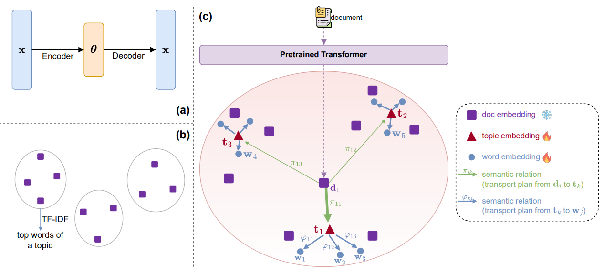

# FASTopic

FASTopic (Wu et al., 2024) is a neural topic model based on Dual Semantic-relation Reconstruction.

<figure>
  </img>
  <figcaption> Figure 1: Schematic Overview of the FASTopic Model.<br> <i>Figure from Wu et al. (2024)</i> </figcaption>
</figure>

FASTopic, instead of reconstructing Bag-of-words, like classical topic models or VAE-based models do, reconstructs the relations between topics words and documents.

Wu et al. (2025) express semantic relations for this model using the Embedding Transport Plan (ETP) method.

The model uses a combined loss function that helps the model learn semantic relations between topic and word embeddings, and learn to reconstruct these relations.

## Usage

```python
from turftopic import FASTopic

documents = [...]

model = FASTopic(10)
doc_topic_matrix = model.fit_transform(documents)
model.print_topics()
```

## Citation

Please cite the authors of the paper, and  Turftopic when using the FASTopic model:

```bibtex
@inproceedings{
  wu2024fastopic,
  title={{FAST}opic: Pretrained Transformer is a Fast, Adaptive, Stable, and Transferable Topic Model},
  author={Xiaobao Wu and Thong Thanh Nguyen and Delvin Ce Zhang and William Yang Wang and Anh Tuan Luu},
  booktitle={The Thirty-eighth Annual Conference on Neural Information Processing Systems},
  year={2024},
  url={https://openreview.net/forum?id=7t6aq0Fa9D}
}

@article{
  Kardos2025,
  title = {Turftopic: Topic Modelling with Contextual Representations from Sentence Transformers},
  doi = {10.21105/joss.08183},
  url = {https://doi.org/10.21105/joss.08183},
  year = {2025},
  publisher = {The Open Journal},
  volume = {10},
  number = {111},
  pages = {8183},
  author = {Kardos, Márton and Enevoldsen, Kenneth C. and Kostkan, Jan and Kristensen-McLachlan, Ross Deans and Rocca, Roberta},
  journal = {Journal of Open Source Software} 
}
```


## API Reference

::: turftopic.models.fastopic.FASTopic
