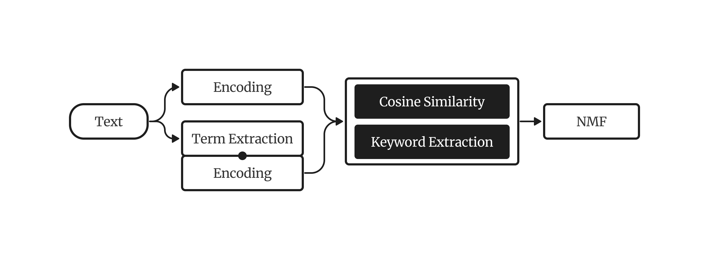
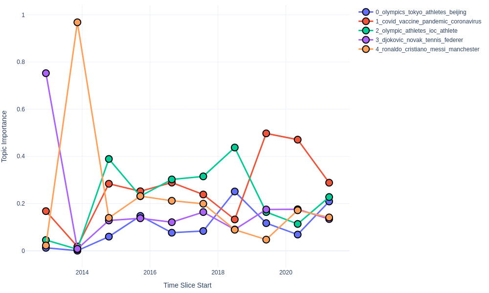

# KeyNMF

KeyNMF is a topic model that relies on contextually sensitive embeddings for keyword retrieval and term importance estimation,
while taking inspiration from classical matrix-decomposition approaches for extracting topics.

<figure>
  
  <figcaption>Schematic overview of KeyNMF</figcaption>
</figure>

Here's an example of how you can fit and interpret a KeyNMF model in the easiest way.

```python
from turftopic import KeyNMF

model = KeyNMF(10, top_n=6)
model.fit(corpus)

model.print_topics()
```

## Keyword Extraction

The first step of the process is gaining enhanced representations of documents by using contextual embeddings.
Both the documents and the vocabulary get encoded with the same sentence encoder.
Keywords are assigned to each document based on the cosine similarity of the document embedding to the embedded words in the document.
Only the top K words with positive cosine similarity to the document are kept.
These keywords are then arranged into a document-term importance matrix where each column represents a keyword that was encountered in at least one document,
and each row is a document. The entries in the matrix are the cosine similarities of the given keyword to the document in semantic space.

- For each document $d$:
    1. Let $x_d$ be the document's embedding produced with the encoder model.
    2. For each word $w$ in the document $d$:
        1. Let $v_w$ be the word's embedding produced with the encoder model.
        2. Calculate cosine similarity between word and document

        $$
        \text{sim}(d, w) = \frac{x_d \cdot v_w}{||x_d|| \cdot ||v_w||}
        $$

    3. Let $K_d$ be the set of $N$ keywords with the highest cosine similarity to document $d$.

    $$
    K_d = \text{argmax}_{K^*} \sum_{w \in K^*}\text{sim}(d,w)\text{, where }
    |K_d| = N\text{, and } \\
    w \in d
    $$

- Arrange positive keyword similarities into a keyword matrix $M$ where the rows represent documents, and columns represent unique keywords.

    $$
    M_{dw} = 
    \begin{cases}
    \text{sim}(d,w), & \text{if } w \in K_d \text{ and } \text{sim}(d,w) > 0 \\
    0, & \text{otherwise}.
    \end{cases}
    $$

You can do this step manually if you want to precompute the keyword matrix.
Keywords are represented as dictionaries mapping words to keyword importances.

```python
model.extract_keywords(["Cars are perhaps the most important invention of the last couple of centuries. They have revolutionized transportation in many ways."])
```

```python
[{'transportation': 0.44713873,
  'invention': 0.560524,
  'cars': 0.5046208,
  'revolutionized': 0.3339205,
  'important': 0.21803442}]
```

A precomputed Keyword matrix can also be used to fit a model:

```python
keyword_matrix = model.extract_keywords(corpus)
model.fit(None, keywords=keyword_matrix)
```

## Topic Discovery

Topics in this matrix are then discovered using Non-negative Matrix Factorization.
Essentially the model tries to discover underlying dimensions/factors along which most of the variance in term importance
can be explained.

- Decompose $M$ with non-negative matrix factorization: $M \approx WH$, where $W$ is the document-topic matrix, and $H$ is the topic-term matrix. Non-negative Matrix Factorization is done with the coordinate-descent algorithm, minimizing square loss:

    $$
    L(W,H) = ||M - WH||^2
    $$

You can fit KeyNMF on the raw corpus, with precomputed embeddings or with precomputed keywords.
```python
# Fitting just on the corpus
model.fit(corpus)

# Fitting with precomputed embeddings
from sentence_transformers import SentenceTransformer

trf = SentenceTransformer("all-MiniLM-L6-v2")
embeddings = trf.encode(corpus)

model = KeyNMF(10, encoder=trf)
model.fit(corpus, embeddings=embeddings)

# Fitting with precomputed keyword matrix
keyword_matrix = model.extract_keywords(corpus)
model.fit(None, keywords=keyword_matrix)
```

## Dynamic Topic Modeling

KeyNMF is also capable of modeling topics over time.
This happens by fitting a KeyNMF model first on the entire corpus, then
fitting individual topic-term matrices using coordinate descent based on the document-topic and document-term matrices in the given time slices.

1. Compute keyword matrix $M$ for the whole corpus.
2. Decompose $M$ with non-negative matrix factorization: $M \approx WH$.
3. For each time slice $t$:
    1. Let $W_t$ be the document-topic proportions for documents in time slice $t$, and $M_t$ be the keyword matrix for words in time slice $t$.
    2. Obtain the topic-term matrix for the time slice, by minimizing square loss using coordinate descent and fixing $W_t$:

    $$
    H_t = \text{argmin}_{H^{*}} ||M_t - W_t H^{*}||^2
    $$

Here's an example of using KeyNMF in a dynamic modeling setting:

```python
from datetime import datetime

from turftopic import KeyNMF

corpus: list[str] = []
timestamps: list[datetime] = []

model = KeyNMF(5, top_n=5, random_state=42)
document_topic_matrix = model.fit_transform_dynamic(
    corpus, timestamps=timestamps, bins=10
)
```

You can use the `print_topics_over_time()` method for producing a table of the topics over the generated time slices.

> This example uses CNN news data.

```python
model.print_topics_over_time()
```

<center>

| Time Slice | 0_olympics_tokyo_athletes_beijing | 1_covid_vaccine_pandemic_coronavirus | 2_olympic_athletes_ioc_athlete | 3_djokovic_novak_tennis_federer | 4_ronaldo_cristiano_messi_manchester |
| - | - | - | - | - | - |
| 2012 12 06 - 2013 11 10 | genocide, yugoslavia, karadzic, facts, cnn | cnn, russia, chechnya, prince, merkel | france, cnn, francois, hollande, bike | tennis, tournament, wimbledon, grass, courts | beckham, soccer, retired, david, learn |
| 2013 11 10 - 2014 10 14 | keith, stones, richards, musician, author | georgia, russia, conflict, 2008, cnn | civil, rights, hear, why, should | cnn, kidneys, traffickers, organ, nepal | ronaldo, cristiano, goalscorer, soccer, player |
| 2014 10 14 - 2015 09 18 | ethiopia, brew, coffee, birthplace, anderson | climate, sutter, countries, snapchat, injustice | women, guatemala, murder, country, worst | cnn, climate, oklahoma, women, topics | sweden, parental, dads, advantage, leave |
| 2015 09 18 - 2016 08 22 | snow, ice, winter, storm, pets | climate, crisis, drought, outbreaks, syrian | women, vulnerabilities, frontlines, countries, marcelas | cnn, warming, climate, sutter, theresa | sutter, band, paris, fans, crowd |
| 2016 08 22 - 2017 07 26 | derby, epsom, sporting, race, spectacle | overdoses, heroin, deaths, macron, emmanuel | fear, died, indigenous, people, arthur | siblings, amnesia, palombo, racial, mh370 | bobbi, measles, raped, camp, rape |
| 2017 07 26 - 2018 06 30 | her, percussionist, drums, she, deported | novichok, hurricane, hospital, deaths, breathing | women, day, celebrate, taliban, international | abuse, harassment, cnn, women, pilgrimage | maradona, argentina, history, jadon, rape |
| 2018 06 30 - 2019 06 03 | athletes, teammates, celtics, white, racism | pope, archbishop, francis, vigano, resignation | racism, athletes, teammates, celtics, white | golf, iceland, volcanoes, atlantic, ocean | rape, sudanese, racist, women, soldiers |
| 2019 06 03 - 2020 05 07 | esports, climate, ice, racers, culver | esports, coronavirus, pandemic, football, teams | racers, women, compete, zone, bery | serena, stadium, sasha, final, naomi | kobe, bryant, greatest, basketball, influence |
| 2020 05 07 - 2021 04 10 | olympics, beijing, xinjiang, ioc, boycott | covid, vaccine, coronavirus, pandemic, vaccination | olympic, japan, medalist, canceled, tokyo | djokovic, novak, tennis, federer, masterclass | ronaldo, cristiano, messi, juventus, barcelona |
| 2021 04 10 - 2022 03 16 | olympics, tokyo, athletes, beijing, medal | covid, pandemic, vaccine, vaccinated, coronavirus | olympic, athletes, ioc, medal, athlete | djokovic, novak, tennis, wimbledon, federer | ronaldo, cristiano, messi, manchester, scored |

</center>

You can also display the topics over time on an interactive HTML figure.
The most important words for topics get revealed by hovering over them.

> You will need to install Plotly for this to work.

```bash
pip install plotly
```

```python
model.plot_topics_over_time(top_k=5)
```

<figure>
  
  <figcaption>Topics over time on a Figure</figcaption>
</figure>

## Online Topic Modeling

KeyNMF can also be fitted in an online manner.
This is done by fitting NMF with batches of data instead of the whole dataset at once.

#### Use Cases:

1. You can use online fitting when you have **very large corpora** at hand, and it would be impractical to fit a model on it at once.
2. You have **new data flowing in constantly**, and need a model that can morph the topics based on the incoming data. You can also do this in a dynamic fashion.
3. You need to **finetune** an already fitted topic model to novel data.

#### Batch Fitting

We will use the batching function from the itertools recipes to produce batches.

> In newer versions of Python (>=3.12) you can just `from itertools import batched`

```python
def batched(iterable, n: int):
    "Batch data into lists of length n. The last batch may be shorter."
    if n < 1:
        raise ValueError("n must be at least one")
    it = iter(iterable)
    while batch := tuple(itertools.islice(it, n)):
        yield batch
```

You can fit a KeyNMF model to a very large corpus in batches like so:

```python
from turftopic import KeyNMF

model = KeyNMF(10, top_n=5)

corpus = ["some string", "etc", ...]
for batch in batched(corpus, 200):
    batch = list(batch)
    model.partial_fit(batch)
```

#### Precomputing the Keyword Matrix

If you desire the best results, it might make sense for you to go over the corpus in multiple epochs:

```python
for epoch in range(5):
    for batch in batched(corpus, 200):
        model.partial_fit(batch)
```

This is mildly inefficient, however, as the texts need to be encoded on every epoch, and keywords need to be extracted.
In such scenarios you might want to precompute and maybe even save the extracted keywords to disk using the `extract_keywords()` method.

Keywords are represented as dictionaries mapping words to keyword importances.

```python
model.extract_keywords(["Cars are perhaps the most important invention of the last couple of centuries. They have revolutionized transportation in many ways."])
```

```python
[{'transportation': 0.44713873,
  'invention': 0.560524,
  'cars': 0.5046208,
  'revolutionized': 0.3339205,
  'important': 0.21803442}]
```

You can extract keywords in batches and save them to disk to a file format of your choice.
In this example I will use NDJSON because of its simplicity.

```python
import json
from pathlib import Path
from typing import Iterable

# Here we are saving keywords to a JSONL/NDJSON file
with Path("keywords.jsonl").open("w") as keyword_file:
    # Doing this in batches is much more efficient than individual texts because
    # of the encoding.
    for batch in batched(corpus, 200):
        batch_keywords = model.extract_keywords(batch)
        # We serialize each
        for keywords in batch_keywords:
            keyword_file.write(json.dumps(keywords) + "\n")

def stream_keywords() -> Iterable[dict[str, float]]:
    """This function streams keywords from the file."""
    with Path("keywords.jsonl").open() as keyword_file:
        for line in keyword_file:
            yield json.loads(line.strip())

for epoch in range(5):
    keyword_stream = stream_keywords()
    for keyword_batch in batched(keyword_stream, 200):
        model.partial_fit(keywords=keyword_batch)
```

#### Dynamic Online Topic Modeling

KeyNMF can be online fitted in a dynamic manner as well.
This is useful when you have large corpora of text over time, or when you want to fit the model on future information flowing in
and want to analyze the topics' changes over time.

When using dynamic online topic modeling you have to predefine the time bins that you will use, as the model can't infer these from the data.

```python
from datetime import datetime

# We will bin by years in a period of 2020-2030
bins = [datetime(year=y, month=1, day=1) for y in range(2020, 2030 + 2, 1)]
```

You can then online fit a dynamic topic model with `partial_fit_dynamic()`.

```python
model = KeyNMF(5, top_n=10)

corpus: list[str] = [...]
timestamps: list[datetime] = [...]

for batch in batched(zip(corpus, timestamps)):
    text_batch, ts_batch = zip(*batch)
    model.partial_fit_dynamic(text_batch, timestamps=ts_batch, bins=bins)
```

## Hierarchical Topic Modeling

When you suspect that subtopics might be present in the topics you find with the model, KeyNMF can be used to discover topics further down the hierarchy.

This is done by utilising a special case of **weighted NMF**, where documents are weighted by how high they score on the parent topic.
In other words:

1. Decompose keyword matrix $M \approx WH$
2. To find subtopics in topic $j$, define document weights $w$ as the $j$th column of $W$.
3. Estimate subcomponents with **wNMF** $M \approx \mathring{W} \mathring{H}$ with document weight $w$
    1. Initialise $\mathring{H}$ and  $\mathring{W}$ randomly.
    2. Perform multiplicative updates until convergence. <br>
        $\mathring{W}^T = \mathring{W}^T \odot \frac{\mathring{H} \cdot (M^T \odot w)}{\mathring{H} \cdot \mathring{H}^T \cdot (\mathring{W}^T \odot w)}$ <br>
        $\mathring{H}^T = \mathring{H}^T \odot \frac{ (M^T \odot w)\cdot \mathring{W}}{\mathring{H}^T \cdot (\mathring{W}^T \odot w) \cdot \mathring{W}}$
4. To sufficiently differentiate the subcomponents from each other a pseudo-c-tf-idf weighting scheme is applied to $\mathring{H}$:
    1. $\mathring{H} = \mathring{H}_{ij} \odot ln(1 + \frac{A}{1+\sum_k \mathring{H}_{kj}})$, where $A$ is the average of all elements in $\mathring{H}$

To create a hierarchical model, you can use the `hierarchy` property of the model.

```python
# This divides each of the topics in the model to 3 subtopics.
model.hierarchy.divide_children(n_subtopics=3)
print(model.hierarchy)
```

<div style="background-color: #F5F5F5; padding: 10px; padding-left: 20px; padding-right: 20px;">
<tt style="font-size: 11pt">
<b>Root </b><br>
├── <b style="color: blue">0</b>: windows, dos, os, disk, card, drivers, file, pc, files, microsoft <br>
│   ├── <b style="color: magenta">0.0</b>: dos, file, disk, files, program, windows, disks, shareware, norton, memory <br>
│   ├── <b style="color: magenta">0.1</b>: os, unix, windows, microsoft, apps, nt, ibm, ms, os2, platform <br>
│   └── <b style="color: magenta">0.2</b>: card, drivers, monitor, driver, vga, ram, motherboard, cards, graphics, ati <br>
└── <b style="color: blue">1</b>: atheism, atheist, atheists, religion, christians, religious, belief, christian, god, beliefs <br>
.    ├── <b style="color: magenta">1.0</b>: atheism, alt, newsgroup, reading, faq, islam, questions, read, newsgroups, readers <br>
.    ├── <b style="color: magenta">1.1</b>: atheists, atheist, belief, theists, beliefs, religious, religion, agnostic, gods, religions <br>
.    └── <b style="color: magenta">1.2</b>: morality, bible, christian, christians, moral, christianity, biblical, immoral, god, religion <br>
</tt>
</div>

For a detailed tutorial on hierarchical modeling click [here](hierarchical.md).

## Considerations

### Strengths

 - Stability, Robustness and Quality: KeyNMF extracts very clean topics even when a lot of noise is present in the corpus, and the model's performance remains relatively stable across domains.
 - Scalability: The model can be fitted in an online fashion, and we recommend that you choose KeyNMF when the number of documents is large (over 100 000).
 - Fail Safe and Adjustable: Since the modelling process consists of multiple easily separable steps it is easy to repeat one if something goes wrong. This also makes it an ideal choice for production usage.
 - Can capture multiple topics in a document.

### Weaknesses

 - Lack of Nuance: Since only the top K keywords are considered and used for topic extraction some of the nuances, especially in long texts might get lost. We therefore recommend that you scale K with the average length of the texts you're working with. For tweets it might be worth it to scale it down to 5, while with longer documents, a larger number (let's say 50) might be advisable.
 - Practitioners have to choose the number of topics a priori.

## API Reference

::: turftopic.models.keynmf.KeyNMF
