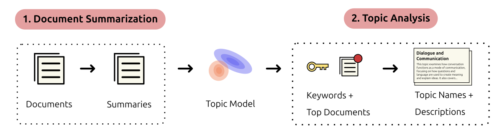

# Topic Analysis with LLMs

Topic analyzers are large language models, that are capable of interpreting topics' contents and can give human-readable descriptions of topics.
This can be incredibly useful when it would require excessive manual labour to label and understand topics.

<figure>
  
  <figcaption>The role of analyzers in topic modelling.</figcaption>
</figure>

Analyzers can do the following tasks:

  - **Summarize documents** to make it easier for your topic model to consume.
  - **Name topics** topics in a sensible and human-readable way based on top documents and keywords
  - **Describe topics** in a couple of sentences

While previously, smaller language models were not able to meaningfully accomplish this task,
advances in in the field now allow you to generate highly accurate topic descriptions on your own laptop using the power of small LLMs.

!!! warning

    The `namers` API is now deprecated and will be removed in Turftopic 1.1.0. Analyzers have full feature parity, and are able to accomplish way more.


## Getting Started

There are multiple types of analyzers in Turftopic that you can utilize for these tasks, all of which can be imported for the `analyzers` module:

!!! quote "Choose an analyzer"

    === "Local LLM (recommended)"

        LLMs from HF Hub are natively supported in Turftopic.
        Our default choice of LLM is **SmolLM3-3B**, as it runs effortlessly on consumer hardware,
        is permissively licensed, allowing commercial use, and generates high-quality output.

        You can specify your model of choice by specifying `model_name="<your_model_here>"`.

        SmolLM is also fine-tuned for reasoning. This is disabled by default to reduce computational burden, but you can enable it by specifying `enable_thinking=True`.

        ```python
        from turftopic.analyzers import LLMAnalyzer

        # We enable document summaries for topic analysis
        analyzer = LLMAnalyzer(use_summaries=True)
        ```

    === "OpenAI API"

        You will have to install OpenAI, as it is not installed by default:
        ```bash
        pip install turftopic[openai]
        export OPENAI_API_KEY="sk-<your key goes here>"
        ```

        The default model is `gpt-5-nano`, which is the cheapest new model in OpenAI's arsenal,
        and we found it generates satisfactory results.

        ```python
        from turftopic.analyzers import OpenAIAnalyzer

        analyzer = OpenAIAnalyzer('gpt-5-nano')
        ```

    === "T5"

        T5 is less resource-intensive then causal language models, but it also generates lower quality results.
        You might have to fiddle around with it to get satisfactory results.

        ```python
        from turftopic import T5Analyzer

        model = T5Analyzer("google/flan-t5-large")
        ```


## Document summarization

You can utilize large-language models for summarizing documents as a pre-processing step.
This might make it easier for certain topic models to find patterns.
You can also instruct the language model to summarize documents from a certain aspect.

```python
from turftopic import KeyNMF

# Your documents
corpus: list[str] = [...]

summarized_documents = [analyzer.summarize_document(doc) for doc in corpus]

# Then we fit the topic model on the document summaries, which might be easier to analyze
model = KeyNMF(10)
model.fit(summarized_documents)
```

## Topic analysis

You can also use LLMs after having trained a topic model to analyze topics' contents.
Analysis in this case consists of: 

1. Naming the topics in a model and
2. giving a short description of its contents.

There are a number of options you should be aware of when doing this:

 - The LLMs will **always** utilize the top **keywords** extracted by a topic model
 - When `use_documents` is set to `True` (default), the analyzer will also use the top 10 documents from the topic model.
 - When `use_summaries` is active, the analyzer first **summarizes top 10 documents** before feeding them to the analyzer. This can be a massive help, since it makes it easier for the analyzer to process the content, and makes sure that the analyzer's context length is enough. It does require more computation, though.

Let's see what this looks like in action:

!!! quote "Analyze topics"

    === "with `model`"

        ```python
        from turftopic import KeyNMF
        from turftopic.analyzers import LLMAnalyzer

        analyzer = LLMAnalyzer(use_summaries=False)

        model = KeyNMF(10).fit(corpus)
        analysis_result = model.analyze_topics(analyzer, use_documents=True)
        ```

    === "with `topic_data`"

        ```python
        from turftopic import KeyNMF
        from turftopic.analyzers import LLMAnalyzer

        analyzer = LLMAnalyzer(use_summaries=False)

        model = KeyNMF(10)
        topic_data = model.prepare_topic_data(corpus)
        analysis_result = topic_data.analyze_topics(analyzer, use_documents=True)
        ```

!!! tip "Topic Naming"

    If you only wish to assign topic names, but not generate a full analysis, you can still use `rename_topics`:
    ```python
    model.rename_topics(analyzer, use_documents=False)
    ```

This will do multiple things:

1. Return an `AnalysisResults` object which contains: `topic_names`, `topic_descriptions` and `document_summaries`, which are the top documents' summaries, when applicable
2. Set these properties on the object it gets called on (`model` or `topic_data`)

`AnalysisResults` can also be turned into a DataFrame or dictionary, by calling `to_df()` and `to_dict()` respectively.

```python
analysis_result.to_df()
```

```
                                         topic_names                                 topic_descriptions
0                         Dialogue and Communication  This topic examines how conversation functions...
1  AI Assistant: Requesting Detailed User Informa...  It describes an assistant that asks the user f...
2          Ethical Generative AI and Language Models  It covers the design and deployment of generat...
3   French–English Translation in Law and Literature  It examines translation between French and Eng...
4  France: Social, Economic, Legal Information an...  It covers how social conversations in France e...
5                   Email-based Python code requests  It depicts a user making requests that involve...
6           Lesson Planning and Classroom Activities  It covers the school-based process of teaching...
7         French cultural conversations for children  It explores how people talk about culture in F...
8            Data Analytics Training and Development  It focuses on structured training programs tha...
9                 Sustainable Energy and Environment  It explores how energy production and use infl...
```

:::turftopic.analyzers.base.AnalysisResults


## Prompting

You can instruct analyzers to specifically deal with the task you are trying to accomplish by using prompts.
Here we will give an overview of how you can do this.

### Providing Task Context

Sometimes you might have a specific task that might require additional information to analyze correctly.
You can add information to the prompts by using the `context` attribute:

```python
from turftopic.analyzers import LLMAnalyzer

analyzer = LLMAnalyzer(context="Analyze topical content in financial documents published by the central bank.")
```

### Fully Custom Prompts

Since all analyzers are generative language models, you can prompt them however you wish. We provide default prompts, which we found to prove well, but you are more than free to modify these.

Prompts internally get formatted with `str.format()`, so all templated content should be in-between curly brackets.
Analyzers have a number of prompts:

    system_prompt = DEFAULT_SYSTEM_PROMPT
    summary_prompt = SUMMARY_PROMPT
    namer_prompt = NAMER_PROMPT
    description_prompt = DESCRIPTION_PROMPT

1. `system_prompt` describes the general role of the language model, and is not templated.
2. `summary_prompt`, which is responsible for providing document summaries, and is templated with `{document}`
3. `namer_prompt`, which describes how topics should be named, and is templated with `{keywords}`
4. `description_prompt`, which dictates how topic descriptions should be generated and is templated with `{keywords}`

Documents are added at the end, when `use_documents=True`.

??? note "Click to see example"

    ```python
    from turftopic.analyzers import LLMAnalyzer

    system_prompt = """
    You are a topic analyzer.
    Follow instructions closely and exactly.
    """

    namer_prompt = """
    Please provide a human-readable name for a topic.
    The topic is described by the following set of keywords: {keywords}.
    """

    description_prompt = """
    Describe the following topic in a couple of sentences.
    The topic is described by the following set of keywords: {keywords}.
    """

    summary_prompt = """
    Summarize the following document: {document}
    """

    namer = LLMAnalyzer(
        system_prompt=system_prompt,
        namer_prompt=namer_prompt,
        description_prompt=description_prompt,
        summary_prompt=summary_prompt
    )
    ```

## API Reference

:::turftopic.analyzers.base.Analyzer

:::turftopic.analyzers.hf_llm.LLMAnalyzer

:::turftopic.analyzers.openai.OpenAIAnalyzer

:::turftopic.analyzers.t5.T5Analyzer
