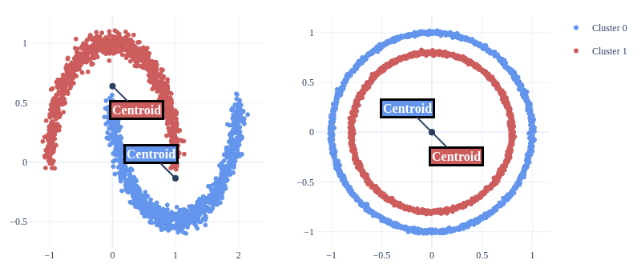
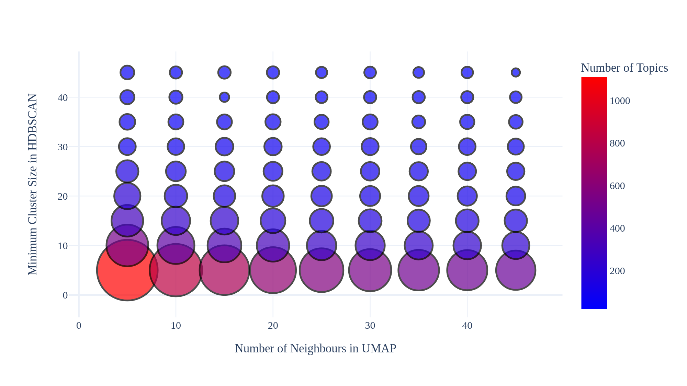

# Clustering Topic Models

Clustering topic models conceptualize topic modeling as a clustering task.
Essentially a topic for these models is a tightly packed group of documents in semantic space.

The first contextually sensitive clustering topic model was introduced with Top2Vec, and BERTopic has also iterated on this idea.

Turftopic contains flexible implementations of these models where you have control over each of the steps in the process,
while sticking to a minimal amount of extra dependencies.
While the models themselves can be equivalent to BERTopic and Top2Vec implementations, Turftopic might not offer some of the implementation-specific features,
that the other libraries boast.

## The Model

### 1. Dimensionality Reduction

It is common practice in clustering topic modeling literature to reduce the dimensionality of the embeddings before clustering them.
This is to avoid the curse of dimensionality, an issue, which many clustering models are affected by.

Dimensionality reduction by default is done with scikit-learn's TSNE implementation in Turftopic,
but users are free to specify the model that will be used for dimensionality reduction.

Our knowledge about the impacts of choice of dimensionality reduction is limited, and has not yet been explored in the literature.
Top2Vec and BERTopic both use UMAP, which has a number of desirable properties over alternatives (arranging data points into cluster-like structures, better preservation of global structure than TSNE, speed).

### 2. Clustering

After reducing the dimensionality of the embeddings, they are clustered with a clustering model.
As HDBSCAN  has only been part of scikit-learn since version 1.3.0, Turftopic uses OPTICS as its default.

Some clustering models are capable of discovering the number of clusters in the data.
This is a useful and yet-to-be challenged property of clustering topic models.

Practice suggests, however, that in large corpora, this frequently results in a very large number of topics, which is impractical for interpretation.
Models' hyperparameters can be adjusted to account for this behaviour, but the impact of choice of hyperparameters on topic quality is more or less unknown.

### 3a. Term Importance: Proximity to Cluster Centroids

Clustering topic models rely on post-hoc term importance estimation.
Currently there are two methods used for this.

The solution introduced in Top2Vec (Angelov, 2020) is that of estimating terms' importances for a given topic from their
embeddings' cosine similarity to the centroid of the embeddings in a cluster.

<figure>
  
  <figcaption>Terms Close to the Topic Vector <br>(figure from Top2Vec documentation)</figcaption>
</figure>

This has three implications:

1. Topic descriptions are very specific. As the closest terms to the topic vector are selected, they tend to also be very close to each other.
 The issue with this is that many of the documents in a topic might not get proper coverage.
2. It is assumed that the clusters are convex and spherical. This might not at all be the case, and especially when clusters are concave, 
 the closest terms to the centroid might end up describing a different, or nonexistent topic.
 In other words: The mean might not be a representative datapoint of the population.
3. Noise rarely gets into topic descriptions. Since functions words or contaminating terms are not very likely to be closest to the topic vector,
 decriptions are typically clean.

<figure>
  
  <figcaption>Centroids of Non-Convex Clusters</figcaption>
</figure>

### 3b. Term Importance: c-TF-IDF

The solution to this issue, suggested by Grootendorst (2022) to this issue was c-TF-IDF.

c-TF-IDF is a weighting scheme based on the number of occurrences of terms in each cluster.
Terms which frequently occur in other clusters are inversely weighted so that words, which are specific to a topic gain larger importance.

Let $X$ be the document term matrix where each element ($X_{ij}$) corresponds with the number of times word $j$ occurs in a document $i$.
Turftopic uses a modified version of c-TF-IDF, which is calculated in the following manner:

- Estimate weight of term $j$ for topic $z$: <br>
$tf_{zj} = \frac{t_{zj}}{w_z}$, where 
$t_{zj} = \sum_{i \in z} X_{ij}$ is the number of occurrences of a word in a topic and 
$w_{z}= \sum_{j} t_{zj}$ is all words in the topic <br>
- Estimate inverse document/topic frequency for term $j$:  
$idf_j = log(\frac{N}{\sum_z |t_{zj}|})$, where
$N$ is the total number of documents.
- Calculate importance of term $j$ for topic $z$:   
$c-TF-IDF{zj} = tf_{zj} \cdot idf_j$

This solution is generally to be preferred to centroid-based term importance (and the default in Turftopic), as it is more likely to give correct results.
On the other hand, c-TF-IDF can be sensitive to words with atypical statistical properties (stop words), and can result in low diversity between topics, when clusters are joined post-hoc.

## Comparison to BERTopic and Top2Vec

Turftopic's implementation differs in multiple places to BERTopic and Top2Vec.
You can, however, construct models in Turftopic that imitate the behaviour of these other packages.

The main differences to these packages are:
 - The c-TF-IDF formulae are not identical. BERTopic's version might be added in the future for compatibility.
 - Dimensionality reduction in BERTopic and Top2Vec is done with UMAP.
 - Clustering is in BERTopic and Top2Vec is done with HDBSCAN.
 - Turftopic does not include many of the visualization and model-specific utilities that BERTopic does.

To get closest to the functionality of the two other packages you can manually set the clustering and dimensionality reduction model when creating the models:

You will need UMAP and scikit-learn>=1.3.0:

```bash
pip install umap-learn scikit-learn>=1.3.0
```

This is how you build a BERTopic-like model in Turftopic:

```python
from turftopic import ClusteringTopicModel
from sklearn.cluster import HDBSCAN
import umap

# I also included the default parameters of BERTopic so that the behaviour is as
# close as possible
berttopic = ClusteringTopicModel(
    dimensionality_reduction=umap.UMAP(
        n_neighbors=10,
        n_components=5,
        min_dist=0.0,
        metric="cosine",
    ),
    clustering=HDBSCAN(
        min_cluster_size=15,
        metric="euclidean",
        cluster_selection_method="eom",
    ),
    feature_importance="ctfidf",
)
```

This is how you build a Top2Vec model in Turftopic:

```python
top2vec = ClusteringTopicModel(
    dimensionality_reduction=umap.UMAP(
        n_neighbors=15,
        n_components=5,
        metric="cosine"
    ),
    clustering=HDBSCAN(
        min_cluster_size=15,
        metric="euclidean",
        cluster_selection_method="eom",
    ),
    feature_importance="centroid",
)
```

## Considerations

### Strengths

 - Automatic Discovery of Number of Topics: Clustering models can find the number of topics by themselves. This is a useful quality of these models as practicioners can rarely make an informed decision about the number of topics a-priori.
 - No Assumptions of Normality: With clustering models you can avoid making assumptions about cluster shapes. This is in contrast with GMMs, which assume topics to be Gaussian components.
 - Outlier Detection: OPTICS, HDBSCAN or DBSCAN contain outlier detection. This way, outliers do not influence topic representations.
 - Not Affected by Embedding Size: Since the models include dimensionality reduction, they are not as influenced by the curse of dimensionality as other methods.

### Weaknesses

 - Scalability: Clustering models typically cannot be fitted in an online fashion, and manifold learning is usually inefficient in large corpora. When the number of texts is huge, the number of topics also gets inflated, which is impractical for interpretation.
 - Lack of Nuance: The models are unable to capture multiple topics in a document or capture uncertainty around topic labels. This makes the models impractical for longer texts as well.
 - Sensitivity to Hyperparameters: While do not have to set the number of topics directly, the hyperparameters you choose has a huge impact on the number of topics you will end up getting. (see figure)
 - Transductivity: Some clustering methods are transductive, meaning you can't predict topical content for new documents, as they would change the cluster structure.

<figure>
  
  <figcaption>Effect of UMAP's and HDBSCAN's Hyperparameters on the Number of Topics in 20 Newsgroups</figcaption>
</figure>

## API Reference

::: turftopic.models.cluster.ClusteringTopicModel
