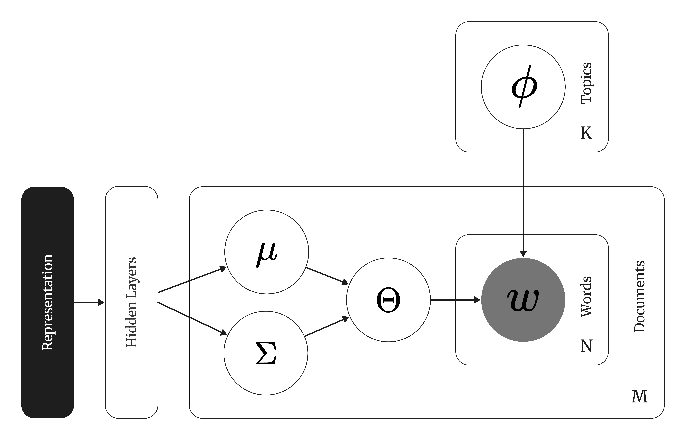

# Variational Autoencoding Topic Models

Topic models based on Variational Autoencoding are generative models based on ProdLDA (citation) enhanced with contextual representations.

<figure>
  
  <figcaption>Pseudo-Plate Notation of Autoencoding Topic Models</figcaption>
</figure>

You will also hear people refer to these models as CTMs or Contextualized Topic Models.
This is confusing, as technically all of the models in Turftopic are contextualized, but most of them do not use autoencoding variational inference.
We will therefore stick to calling these models Autoencoding topic models.

You will need to install Turftopic with Pyro to be able to use these models:

```bash
pip install turftopic[pyro-ppl]
```

## The Model

Autoencoding Topic Models are generative models over word content in documents, similarly to classical generative topic models, such as Latent Dirichlet Allocation.
This means that we have a probabilistic description of how words in documents are generated based on latent representations (topic proportions).

Where these models differ from LDA is that they:

 1. Use a Logistic Normal distribution for topic proportions instead of a Dirichlet.
 2. Words in a document are determined by a product of experts, rather than drawing a topic label for each word in a document.
 3. Use Amortized Variational Inference:
  A mapping between parameters of the topic proportions and input representations is learned by an artificial neural network (encoder network), instead of sampling the posterior.

Note that term importance estimation is built into the model, instead of 

Depending on what the input of the encoder network is, we are either talking about a ZeroShotTM or a CombinedTM.
ZeroShotTM(default) only uses the contextual embeddings as the input, while CombinedTM concatenates these to Bag-of-Words representations.

You can choose either, by modifying the `combined` parameter of the model:

```python
from turftopic import AutoEncodingTopicModel

zeroshot_tm = AutoEncodingTopicModel(10, combined=False)

combined_tm = AutoEncodingTopicModel(10, combined=True)
```

## Comparison with the CTM Package

The main difference is in the implementation. CTM implements inference from scratch in Torch, whereas Turftopic uses a 3rd party inference engine (and probabilistic programming language) called Pyro.
This has a number of implications, most notably:

 - Default hyperparameters are different, as such you might get different results with the two packages.
 - Turftopic's inference is more stable, and is less likely to fail due to issues with numerical stability.
  This is simply because Pyro is a very well tested and widely used engine, and is a more reliable choice than writing inference by hand.
 - Inference in CTM might be faster, as it uses a specific implementation that does not need to be universal in opposition to Pyro.

Turftopic, similarly to Clustering models might not contain some model specific utilites, that CTM boasts.

## Considerations

### Strengths

 - Topic Proportions: Autoencoding models can capture multiple topics in a document and can therefore capture nuances that other models might not be able to.
 - Online Learning: You can fit these models in an online way as they use minibatch learning. (WARNING: This is not yet implemented in Turftopic)

### Weaknesses

 - Low Quality and Sensitivity to Noise: The quality of topics tends to be lower than with other models. Noise might get into topic description, there might be overlap between topics, and there might be topics that are hard to interpret. Other models typically outperform autoencoding models.
 - Curse of Dimensionality: The number of parameters in these models is typically very high. This makes inference difficult and might result in poor convergence, and very slow inference.
 - Black Box: Since the mapping to parameter space is learned by a neural network, the model is very black box in nature and it's hard to know why and what it learns.


## API Reference

::: turftopic.models.ctm.AutoEncodingTopicModel
