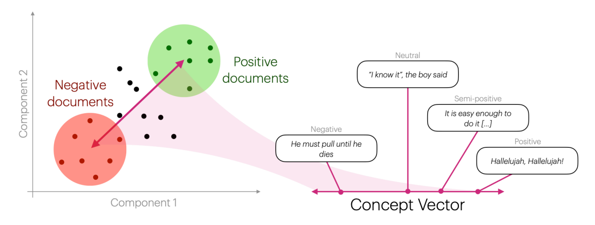

# Concept Vector Projection

Concept Vector Projection is an embedding-based method for extracting continuous sentiment (or other) scores from free-text documents.

<figure>
  </img>
  <figcaption> Figure 1: Schematic Overview of Concept Vector Projection.<br> <i>Figure from Lyngbæk et al. (2025)</i> </figcaption>
</figure>

The method rests on the idea that one can construct a _concept vector_ by encoding positive and negative _seed phrases_ with a transformer, then taking the difference of these mean vectors.
We can then project other documents' embeddings onto these concept vectors by taking the dot product with the concept vector, thereby giving continuous scores on how related documents are to a given concept.

## Usage

### Single Concept

When projecting onto a single concept, you should specify the seeds as a tuple of positive and negative phrases.

```python
from turftopic import ConceptVectorProjection

positive = [
    "I love this product",
    "This is absolutely lovely",
    "My daughter is going to adore this"
]
negative = [
    "This product is not at all as advertised, I'm very displeased",
    "I hate this",
    "What a horrible way to deal with people"
]
cvp = ConceptVectorProjection(seeds=(positive, negative))

test_documents = ["My cute little doggy", "Few this is digusting"]
doc_concept_matrix = cvp.transform(test_documents)
print(doc_concept_matrix)
```

```python
[[0.24265897]
 [0.01709663]]
```

### Multiple Concepts

When projecting documents to multiple concepts at once, you will need to specify seeds for each concept, as well as its name.
Internally this is handled with an `OrderedDict`, which you can either specify yourself, or Turftopic can do it for you:

```python
import pandas as pd
from collections import OrderedDict

cuteness_seeds = (["Absolutely adorable", "I love how he dances with his little feet"], ["What a big slob of an abomination", "A suspicious old man sat next to me on the bus today"])
bullish_seeds = (["We are going to the moon", "This stock will prove an incredible investment"], ["I will short the hell out of them", "Uber stocks drop 7% in value after down-time."])

# Either specify it like this:
seeds = [("cuteness", cuteness_seeds), ("bullish", bullish_seeds)]
# or as an OrderedDict:
seeds = OrderedDict([("cuteness", cuteness_seeds), ("bullish", bullish_seeds)])
cvp = ConceptVectorProjection(seeds=seeds)

test_documents = ["What an awesome investment", "Tiny beautiful kitty-cat"]
doc_concept_matrix = cvp.transform(test_documents)
concept_df = pd.DataFrame(doc_concept_matrix, columns=cvp.get_feature_names_out())
print(concept_df)
```

```python
   cuteness   bullish
0  0.085957  0.288779
1  0.269454  0.009495
```

## API Reference


::: turftopic.models.cvp.ConceptVectorProjection


