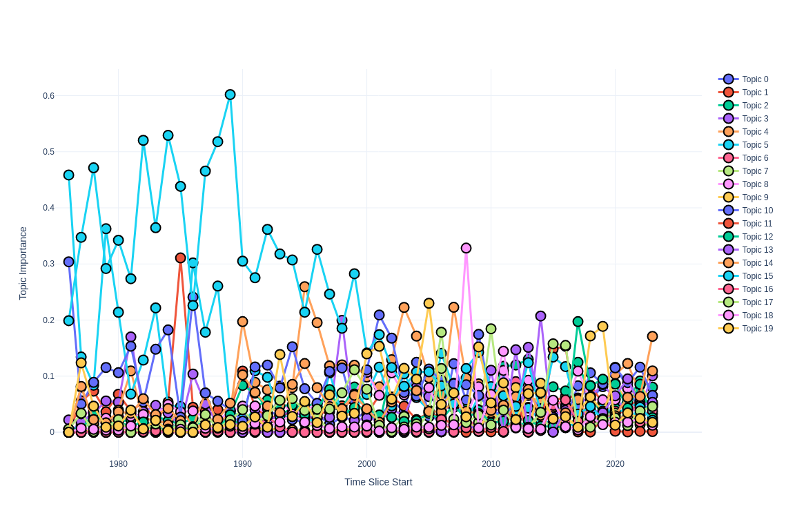

# Dynamic Topic Modeling

If you want to examine the evolution of topics over time, you will need a dynamic topic model.

> Note that regular static models can also be used to study the evolution of topics and information dynamics, but they can't capture changes in the topics themselves.

## Models

In Turftopic you can currently use three different topic models for modeling topics over time:
1. [ClusteringTopicModel](clustering.md), where an overall model is fitted on the whole corpus, and then term importances are estimated over time slices.
2. [GMM](GMM.md), similarly to clustering models, term importances are reestimated per time slice
3. [KeyNMF](KeyNMF.md), an overall decomposition is done, then using coordinate descent, topic-term-matrices are recalculated based on document-topic importances in the given time slice.

## Usage

Dynamic topic models in Turftopic have a unified interface.
To fit a dynamic topic model you will need a corpus, that has been annotated with timestamps.
The timestamps need to be Python `datetime` objects, but pandas `Timestamp` object are also supported.

Models that have dynamic modeling capabilities (`KeyNMF`, `GMM` and `ClusteringTopicModel`) have a `fit_transform_dynamic()` method, that fits the model on the corpus over time.

```python
from datetime import datetime

from turftopic import KeyNMF

corpus: list[str] = [...]
timestamps: list[datetime] = [...]

model = KeyNMF(5)
document_topic_matrix = model.fit_transform_dynamic(corpus, timestamps=timestamps)
```

To display results in a table, you can use the `print_topics_over_time()` method.

```python
model.print_topics_over_time(top_k=10)
```

<center>

| Time Slice | Topic 0                           | Topic 1                            | Topic 2                      |
|------------|-----------------------------------|------------------------------------|-----------------------------|
| 1950-1970  | vinyl, record, player, album       | hard bop, beatles, elvis, doors    |                             |
| 1970-1990  | cassettes, walkman, vinyl, recording | steely, genesis, jackson, queen   | ...                         |
| 1990-2010  | cd, mp3, digital, dvd               | muse, dilla, radiohead, ...       |                             |
| 2010-2020  | ...                               |                                    |                             |

</center>

You can also display the topics over time on an interactive HTML figure.
The most important words for topics get revealed by hovering over them.

> You will need to install Plotly for this to work.

```bash
pip install plotly
```

```python
model.plot_topics_over_time(top_k=5)
```

<figure>
  
  <figcaption>Topics over time on a Figure</figcaption>
</figure>

## Interface

All dynamic topic models have a `temporal_components_` attribute, which contains the topic-term matrices for each time slice, along with a `temporal_importance_` attribute, which contains the importance of each topic in each time slice.

::: turftopic.dynamic.DynamicTopicModel
