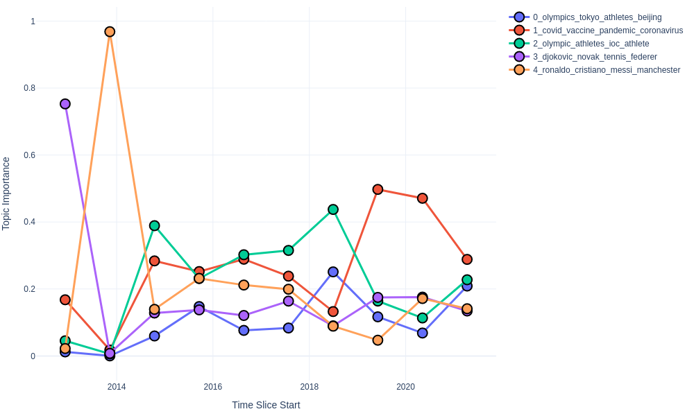

# Dynamic Topic Modeling

If you want to examine the evolution of topics over time, you will need a dynamic topic model.

> Note that regular static models can also be used to study the evolution of topics and information dynamics, but they can't capture changes in the topics themselves.

## Models

In Turftopic you can currently use three different topic models for modeling topics over time:

1. [ClusteringTopicModel](clustering.md), where an overall model is fitted on the whole corpus, and then term importances are estimated over time slices.
2. [GMM](GMM.md), similarly to clustering models, term importances are reestimated per time slice
3. [KeyNMF](KeyNMF.md), an overall decomposition is done, then using coordinate descent, topic-term-matrices are recalculated based on document-topic importances in the given time slice.

## Usage

Dynamic topic models in Turftopic have a unified interface.
To fit a dynamic topic model you will need a corpus, that has been annotated with timestamps.
The timestamps need to be Python `datetime` objects, but pandas `Timestamp` object are also supported.

Models that have dynamic modeling capabilities (`KeyNMF`, `GMM` and `ClusteringTopicModel`) have a `fit_transform_dynamic()` method, that fits the model on the corpus over time.

```python
from datetime import datetime

from turftopic import KeyNMF

corpus: list[str] = []
timestamps: list[datetime] = []

model = KeyNMF(5, top_n=5, random_state=42)
document_topic_matrix = model.fit_transform_dynamic(
    corpus, timestamps=timestamps, bins=10
)
```

You can use the `print_topics_over_time()` method for producing a table of the topics over the generated time slices.

> This example uses CNN news data.

```python
model.print_topics_over_time()
```

<center>

| Time Slice | 0_olympics_tokyo_athletes_beijing | 1_covid_vaccine_pandemic_coronavirus | 2_olympic_athletes_ioc_athlete | 3_djokovic_novak_tennis_federer | 4_ronaldo_cristiano_messi_manchester |
| - | - | - | - | - | - |
| 2012 12 06 - 2013 11 10 | genocide, yugoslavia, karadzic, facts, cnn | cnn, russia, chechnya, prince, merkel | france, cnn, francois, hollande, bike | tennis, tournament, wimbledon, grass, courts | beckham, soccer, retired, david, learn |
| 2013 11 10 - 2014 10 14 | keith, stones, richards, musician, author | georgia, russia, conflict, 2008, cnn | civil, rights, hear, why, should | cnn, kidneys, traffickers, organ, nepal | ronaldo, cristiano, goalscorer, soccer, player |
| 2014 10 14 - 2015 09 18 | ethiopia, brew, coffee, birthplace, anderson | climate, sutter, countries, snapchat, injustice | women, guatemala, murder, country, worst | cnn, climate, oklahoma, women, topics | sweden, parental, dads, advantage, leave |
| 2015 09 18 - 2016 08 22 | snow, ice, winter, storm, pets | climate, crisis, drought, outbreaks, syrian | women, vulnerabilities, frontlines, countries, marcelas | cnn, warming, climate, sutter, theresa | sutter, band, paris, fans, crowd |
| 2016 08 22 - 2017 07 26 | derby, epsom, sporting, race, spectacle | overdoses, heroin, deaths, macron, emmanuel | fear, died, indigenous, people, arthur | siblings, amnesia, palombo, racial, mh370 | bobbi, measles, raped, camp, rape |
| 2017 07 26 - 2018 06 30 | her, percussionist, drums, she, deported | novichok, hurricane, hospital, deaths, breathing | women, day, celebrate, taliban, international | abuse, harassment, cnn, women, pilgrimage | maradona, argentina, history, jadon, rape |
| 2018 06 30 - 2019 06 03 | athletes, teammates, celtics, white, racism | pope, archbishop, francis, vigano, resignation | racism, athletes, teammates, celtics, white | golf, iceland, volcanoes, atlantic, ocean | rape, sudanese, racist, women, soldiers |
| 2019 06 03 - 2020 05 07 | esports, climate, ice, racers, culver | esports, coronavirus, pandemic, football, teams | racers, women, compete, zone, bery | serena, stadium, sasha, final, naomi | kobe, bryant, greatest, basketball, influence |
| 2020 05 07 - 2021 04 10 | olympics, beijing, xinjiang, ioc, boycott | covid, vaccine, coronavirus, pandemic, vaccination | olympic, japan, medalist, canceled, tokyo | djokovic, novak, tennis, federer, masterclass | ronaldo, cristiano, messi, juventus, barcelona |
| 2021 04 10 - 2022 03 16 | olympics, tokyo, athletes, beijing, medal | covid, pandemic, vaccine, vaccinated, coronavirus | olympic, athletes, ioc, medal, athlete | djokovic, novak, tennis, wimbledon, federer | ronaldo, cristiano, messi, manchester, scored |

</center>

You can also display the topics over time on an interactive HTML figure.
The most important words for topics get revealed by hovering over them.

> You will need to install Plotly for this to work.

```bash
pip install plotly
```

```python
model.plot_topics_over_time(top_k=5)
```

<figure>
  
  <figcaption>Topics over time on a Figure</figcaption>
</figure>

## Interface

All dynamic topic models have a `temporal_components_` attribute, which contains the topic-term matrices for each time slice, along with a `temporal_importance_` attribute, which contains the importance of each topic in each time slice.

::: turftopic.dynamic.DynamicTopicModel
