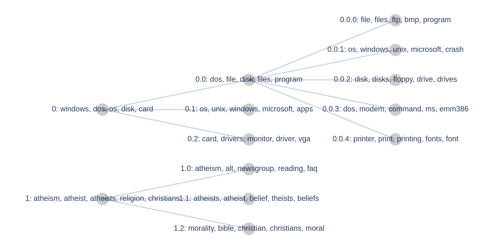

# Hierarchical Topic Modeling

> Note: Hierarchical topic modeling in Turftopic is still in its early stages, you can expect more visualization utilities, tools and models in the future :sparkles:

You might expect some topics in your corpus to belong to a hierarchy of topics.
Some models in Turftopic (currently only [KeyNMF](KeyNMF.md)) allow you to investigate hierarchical relations and build a taxonomy of topics in a corpus.

## Divisive Hierarchical Modeling

Currently Turftopic, in contrast with other topic modeling libraries only allows for hierarchical modeling in a divisive context.
This means that topics can be divided into subtopics in a **top-down** manner.
[KeyNMF](KeyNMF.md) does not discover a topic hierarchy automatically,
 but you can manually instruct the model to find subtopics in larger topics.

As a demonstration, let's load a corpus, that we know to have hierarchical themes.

```python
from sklearn.datasets import fetch_20newsgroups

corpus = fetch_20newsgroups(
    subset="all",
    remove=("headers", "footers", "quotes"),
    categories=[
        "comp.os.ms-windows.misc",
        "comp.sys.ibm.pc.hardware",
        "talk.religion.misc",
        "alt.atheism",
    ],
).data
```

In this case, we have two base themes, which are **computers**, and **religion**.
Let us fit a KeyNMF model with two topics to see if the model finds these.

```python
from turftopic import KeyNMF

model = KeyNMF(2, top_n=15, random_state=42).fit(corpus)
model.print_topics()
```

| Topic ID | Highest Ranking |
| - | - |
| 0 | windows, dos, os, disk, card, drivers, file, pc, files, microsoft |
| 1 | atheism, atheist, atheists, religion, christians, religious, belief, christian, god, beliefs |

The results conform our intuition. Topic 0 seems to revolve around IT, while Topic 1 around atheism and religion.
We can already suspect, however that more granular topics could be discovered in this corpus.
For instance Topic 0 contains terms related to operating systems, like *windows* and *dos*, but also components, like *disk* and *card*.

We can access the hierarchy of topics in the model at the current stage, with the model's `hierarchy` property.

```python
print(model.hierarchy)
```

<div style="background-color: #F5F5F5; padding: 10px; padding-left: 20px; padding-right: 20px;">
<tt style="font-size: 11pt">
<b>Root </b><br>
├── <b style="color: blue">0</b>: windows, dos, os, disk, card, drivers, file, pc, files, microsoft <br>
└── <b style="color: blue">1</b>: atheism, atheist, atheists, religion, christians, religious, belief, christian, god, beliefs <br>
</tt>
</div>

There isn't much to see yet, the model contains a flat hierarchy of the two topics we discovered and we are at root level.
We can dissect these topics, by adding a level to the hierarchy.

Let us add 3 subtopics to each topic on the root level.

```python
model.hierarchy.divide_children(n_subtopics=3)
```

<div style="background-color: #F5F5F5; padding: 10px; padding-left: 20px; padding-right: 20px;">
<tt style="font-size: 11pt">
<b>Root </b><br>
├── <b style="color: blue">0</b>: windows, dos, os, disk, card, drivers, file, pc, files, microsoft <br>
│   ├── <b style="color: magenta">0.0</b>: dos, file, disk, files, program, windows, disks, shareware, norton, memory <br>
│   ├── <b style="color: magenta">0.1</b>: os, unix, windows, microsoft, apps, nt, ibm, ms, os2, platform <br>
│   └── <b style="color: magenta">0.2</b>: card, drivers, monitor, driver, vga, ram, motherboard, cards, graphics, ati <br>
└── <b style="color: blue">1</b>: atheism, atheist, atheists, religion, christians, religious, belief, christian, god, beliefs <br>
.    ├── <b style="color: magenta">1.0</b>: atheism, alt, newsgroup, reading, faq, islam, questions, read, newsgroups, readers <br>
.    ├── <b style="color: magenta">1.1</b>: atheists, atheist, belief, theists, beliefs, religious, religion, agnostic, gods, religions <br>
.    └── <b style="color: magenta">1.2</b>: morality, bible, christian, christians, moral, christianity, biblical, immoral, god, religion <br>
</tt>
</div>

As you can see, the model managed to identify meaningful subtopics of the two larger topics we found earlier.
Topic 0 got divided into a topic mostly concerned with dos and windows, a topic on operating systems in general, and one about hardware,
while Topic 1 contains a topic about newsgroups, one about atheism, and one about morality and christianity.

You can also easily access nodes of the hierarchy by indexing it:
```python
model.hierarchy[0]
```

<div style="background-color: #F5F5F5; padding: 10px; padding-left: 20px; padding-right: 20px;">
<tt style="font-size: 11pt">
<b style="color: blue">0</b>: windows, dos, os, disk, card, drivers, file, pc, files, microsoft <br>
├── <b style="color: magenta">0.0</b>: dos, file, disk, files, program, windows, disks, shareware, norton, memory <br>
├── <b style="color: magenta">0.1</b>: os, unix, windows, microsoft, apps, nt, ibm, ms, os2, platform <br>
└── <b style="color: magenta">0.2</b>: card, drivers, monitor, driver, vga, ram, motherboard, cards, graphics, ati <br>
</tt>
</div>

You can also divide individual topics to a number of subtopics, by using the `divide()` method.
Let us divide Topic 0.0 to 5 subtopics.

```python
model.hierarchy[0][0].divide(5)
model.hierarchy
```

<div style="background-color: #F5F5F5; padding: 10px; padding-left: 20px; padding-right: 20px;">
<tt style="font-size: 11pt">
<b>Root </b><br>
├── <b style="color: blue">0</b>: windows, dos, os, disk, card, drivers, file, pc, files, microsoft <br>
│   ├── <b style="color: magenta">0.0</b>: dos, file, disk, files, program, windows, disks, shareware, norton, memory <br>
│   │   ├── <b style="color: green">0.0.1</b>: file, files, ftp, bmp, program, windows, shareware, directory, bitmap, zip <br>
│   │   ├── <b style="color: green">0.0.2</b>: os, windows, unix, microsoft, crash, apps, crashes, nt, pc, operating <br>
│   │   ├── <b style="color: green">0.0.3</b>: disk, disks, floppy, drive, drives, scsi, boot, hd, norton, ide <br>
│   │   ├── <b style="color: green">0.0.4</b>: dos, modem, command, ms, emm386, serial, commands, 386, drivers, batch <br>
│   │   └── <b style="color: green">0.0.5</b>: printer, print, printing, fonts, font, postscript, hp, printers, output, driver <br>
│   ├── <b style="color: magenta">0.1</b>: os, unix, windows, microsoft, apps, nt, ibm, ms, os2, platform <br>
│   └── <b style="color: magenta">0.2</b>: card, drivers, monitor, driver, vga, ram, motherboard, cards, graphics, ati <br>
└── <b style="color: blue">1</b>: atheism, atheist, atheists, religion, christians, religious, belief, christian, god, beliefs <br>
.    ├── <b style="color: magenta">1.0</b>: atheism, alt, newsgroup, reading, faq, islam, questions, read, newsgroups, readers <br>
.    ├── <b style="color: magenta">1.1</b>: atheists, atheist, belief, theists, beliefs, religious, religion, agnostic, gods, religions <br>
.    └── <b style="color: magenta">1.2</b>: morality, bible, christian, christians, moral, christianity, biblical, immoral, god, religion <br>
</tt>
</div>

## Visualization
You can visualize hierarchies in Turftopic by using the `plot_tree()` method of a topic hierarchy.
The plot is interactive and you can zoom in or hover on individual topics to get an overview of the most important words.

```python
model.hierarchy.plot_tree()
```

<figure>
  
  <figcaption>Tree plot of the hierarchy.</figcaption>
</figure>


## API reference

::: turftopic.hierarchical.TopicNode


