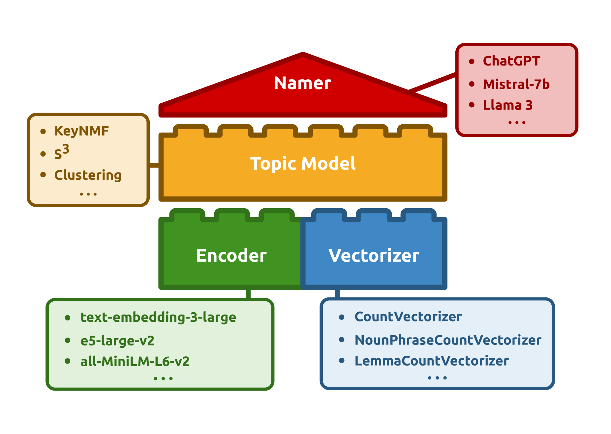

# Defining and Training Topic Models

In order to start modeling your corpora, you will need to define a topic model.
There are a wide array of available models in Turftopic that all have their unique behaviour.
On the other hand all models will need to have certain components, and have attributes you can adjust to your needs.
This page provides a guide on how to define models, train them, and use them for inference.

<figure>
  
  <figcaption>Components of a Topic Modeling Pipeline</figcaption>
</figure>


## Defining a Model

### 1. [Topic Model](model_overview.md)
 In order to initialize a model, you will first need to make a choice about which **topic model** you'd like to use.
You might want to have a look at the [Models](model_overview.md) page in order to make an informed choice about the topic model you intend to train.

Here are some examples of models you can load and use in the package:

=== "KeyNMF"

    ```python
    from turftopic import KeyNMF

    model = KeyNMF(n_components=10, top_n=15)
    ```

=== "ClusteringTopicModel"

    ```python
    from turftopic import ClusteringTopicModel

    model = ClusteringTopicModel(n_reduce_to=10, feature_importance="centroid")
    ```

=== "SemanticSignalSeparation"

    ```python
    from turftopic import SemanticSignalSeparation

    model = SemanticSignalSeparation(n_components=10, feature_importance="combined")
    ```

### 2. [Vectorizer](vectorizers.md)

In Turftopic, all Models have a vectorizer component, which is responsible for extracting word content from documents in the corpus.
This means, that a vectorizer also determines which words will be part of the model's vocabulary.
For a more detailed explanation, see the [Vectorizers](vectorizers.md) page

The default is scikit-learn's CountVectorizer:

```python
from sklearn.feature_extraction.text import CountVectorizer

default_vectorizer = CountVectorizer(min_df=10, stop_words="english")
```

You can add a custom vectorizer to a topic model upon initializing it,
thereby getting different behaviours. You can for instance use noun-phrases in your model instead of words by using `NounPhraseCountVectorizer` or estimate parameters for lemmas by using `LemmaCountVectorizer`


=== "Noun Phrase Extraction"

    ```bash
    pip install turftopic[spacy]
    python -m spacy download "en_core_web_sm"
    ```

    ```python
    from turftopic import KeyNMF
    from turftopic.vectorizers.spacy import NounPhraseCountVectorizer

    model = KeyNMF(10, vectorizer=NounPhraseCountVectorizer("en_core_web_sm"))
    model.fit(corpus)
    model.print_topics()
    ```

    | Topic ID | Highest Ranking |
    | - | - |
    | | ... |
    | 3 | fanaticism, theism, fanatism, all fanatism, theists, strong theism, strong atheism, fanatics, precisely some theists, all theism |
    | 4 | religion foundation darwin fish bumper stickers, darwin fish, atheism, 3d plastic fish, fish symbol, atheist books, atheist organizations, negative atheism, positive atheism, atheism index |
    | | ... |


=== "Lemma Extraction"

    ```bash
    pip install turftopic[spacy]
    python -m spacy download "en_core_web_sm"
    ```

    ```python
    from turftopic import KeyNMF
    from turftopic.vectorizers.spacy import LemmaCountVectorizer

    model = KeyNMF(10, vectorizer=LemmaCountVectorizer("en_core_web_sm"))
    model.fit(corpus)
    model.print_topics()
    ```

    | Topic ID | Highest Ranking |
    | - | - |
    | 0 | atheist, theist, belief, christians, agnostic, christian, mythology, asimov, abortion, read |
    | 1 | morality, moral, immoral, objective, society, animal, natural, societal, murder, morally |
    | | ... |


=== "Multilingual Tokenization (Arabic example)"

    ```python
    from turftopic import KeyNMF
    from turftopic.vectorizers.spacy import TokenCountVectorizer

    # CountVectorizer for Arabic
    vectorizer = TokenCountVectorizer("ar", min_df=10)

    model = KeyNMF(
        n_components=10,
        vectorizer=vectorizer,
        encoder="Omartificial-Intelligence-Space/Arabic-MiniLM-L12-v2-all-nli-triplet"
    )
    model.fit(corpus)

    ```

### 3. [Encoder](encoders.md)

Since all models in Turftopic rely on contextual embeddings, you will need to specify a contextual embedding model to use.
The default is [`all-MiniLM-L6-v2`](sentence-transformers/all-MiniLM-L6-v2), which is a very fast and reasonably performant embedding model for English.
You might, however want to use custom embeddings, either because your corpus is not in English, or because you need higher speed or performance.
See a detailed guide on Encoders [here](encoders.md).

Similar to a vectorizer, you can add an encoder to a topic model upon initializing it.

```python
from turftopic import KeyNMF
from sentence_transformers import SentenceTransformer

encoder = SentenceTransformer("parahprase-multilingual-MiniLM-L12-v2")
model = KeyNMF(10, encoder=encoder)
```

### 4. [Namer](namers.md) (*optional*)

A Namer is an optional part of your topic modeling pipeline, that can automatically assign human-readable names to topics.
Namers are technically **not part of your topic model**, and should be used *after training*.
See a detailed guide [here](namers.md).

=== "LLM from HuggingFace"
    ```python
    from turftopic import KeyNMF
    from turftopic.namers import LLMTopicNamer

    model = KeyNMF(10).fit(corpus)
    namer = LLMTopicNamer("HuggingFaceTB/SmolLM2-1.7B-Instruct")

    model.rename_topics(namer)
    ```

=== "ChatGPT"
    ```bash
    pip install openai
    export OPENAI_API_KEY="sk-<your key goes here>"
    ```
    ```python
    from turftopic.namers import OpenAITopicNamer

    namer = OpenAITopicNamer("gpt-4o-mini")
    model.rename_topics(namer)
    model.print_topics()
    ```

    | Topic ID | Topic Name | Highest Ranking |
    | - | - | - |
    | 0 | Operating Systems and Software  | windows, dos, os, ms, microsoft, unix, nt, memory, program, apps |
    | 1 | Atheism and Belief Systems | atheism, atheist, atheists, belief, religion, religious, theists, beliefs, believe, faith |
    | | ... |

## Training and Inference

### Model Training
All models in Turftopic follow a scikit-learn API for fitting topic models.
Every model in the library can be trained by passing a set of documents (a _corpus_) to the model.
This has to be an `Iterable` type object, that has to be reusable as models will typically do multiple passes on the corpus.

```python
corpus: list[str] = ["this is a a document", "this is yet another document", ...]
```
!!! quote "Fit your topic model"
    === "`fit(raw_documents, embeddings=None)`"

        `fit()` simply fits the topic model and returns the same model object fitted.
        You can optionally pass a set of precomputed embeddings for the documents.

        ```python
        model.fit(corpus)
        # or
        model.fit(corpus, embeddings=embeddings)
        ```

    === "`fit_transform(raw_documents, embeddings=None)`"

        `fit_transform()` not only trains the model but also returns topic-proportions in all documents in the corpus.
        ```python
        document_topic_matrix = model.fit_transform(corpus)
        # or 
        document_topic_matrix = model.fit_transform(corpus, embeddings=embeddings)
        print(document_topic_matrix.shape)
        # prints (n_documents, n_topics)
        ```
    === "`prepare_topic_data(corpus, embeddings=None)`"
        
        `prepare_topic_data()` not only fits the model (only if not already fitted), but also saves other aspects of topic inference, which makes it easier to then use this object for pretty printing and visualizing your models (see [Model Interpretation](model_interpretation.md))

        ```python
        topic_data = model.prepare_topic_data(corpus)
        # print to see what attributes you can access.
        print(topic_data)
        ```
        ```
        TopicData
        ├── corpus (1000)
        ├── vocab (1746,)
        ├── document_term_matrix (1000, 1746)
        ├── topic_term_matrix (10, 1746)
        ├── document_topic_matrix (1000, 10)
        ├── document_representation (1000, 384)
        ├── transform
        ├── topic_names (10)
        ├── has_negative_side
        └── hierarchy
        ```
        See [Using TopicData](topic_data.md) for more detail.


### Precomputing Embeddings

In order to cut down on costs/computational load when fitting multiple models in a row, you might want to encode the documents before fitting a model.
Encoding the corpus is the heaviest part of the process and you can spare yourself a lot of time by only doing it once.
Some models have to encode the vocabulary as well, this cannot be done before inference, as the models learn the vocabulary itself from the corpus.

The `fit()` method of all models takes and `embeddings` argument, that allows you to pass a precooked embedding matrix along to fitting.
One thing to watch out for is that you have to pass the embedding model along to the model that was used for encoding the corpus.
This is again, to ensure that the vocabulary gets encoded with the same embedding model as the documents.

Here's a snippet of correct usage:

```python
import numpy as np
from sentence_transformers import SentenceTransformer
from turftopic import GMM, ClusteringTopicModel

encoder = SentenceTransformer("intfloat/e5-large-v2", prompts={"query": "query: ", "passage": "passage: "}, default_prompt_name="query")

corpus: list[str] = ["this is a a document", "this is yet another document", ...]
embeddings = np.asarray(encoder.encode(corpus))

gmm = GMM(10, encoder=encoder).fit(corpus, embeddings=embeddings)

clustering = ClusteringTopicModel(encoder=encoder).fit(corpus, embeddings=embeddings)
```

### Inference

Some models in Turftopic are capable of estimating topic importance scores for documents in your corpus.
In order to get the importance of each topic for the documents in the corpus, you might want to use `fit_transform()` instead of `fit()`

!!! warning
    Note that using `fit()` and `transform()` in succession is not the same as using `fit_transform()` and the later should be preferred under all circumstances.
    For one, not all models have a `transform()` method, but `fit_transform()` is also way more efficient, as documents don't have to be encoded twice.
    Some models have additional optimizations going on when using `fit_transform()`, and the `fit()` method typically uses `fit_transform()` in the background.

```python
document_topic_matrix = model.fit_transform(corpus)
```

This will give you a matrix, where every row is a document and every column represents the importance of a given topic.

You can infer topical content for new documents with a fitted model using the `transform()` method (beware that this only works with inductive methods):

```python
document_topic_matrix = model.transform(new_documents, embeddings=None)
```


