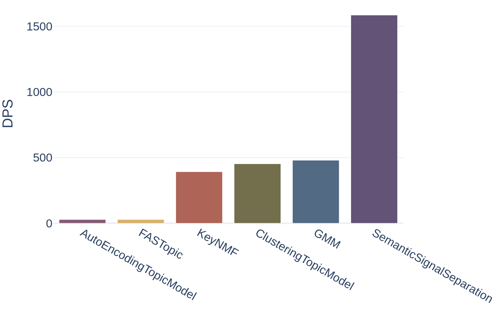
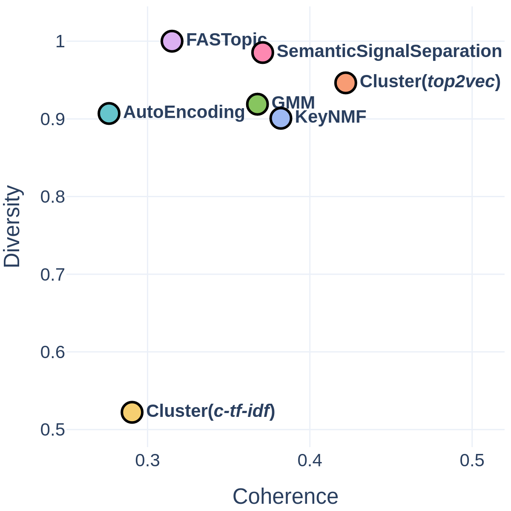

# Model Overview

Turftopic contains implementations of a number of contemporary topic models.
Some of these models might be similar to each other in a lot of aspects, but they might be different in others.
It is quite important that you choose the right topic model for your use case.

| :zap: Speed | :book: Long Documents | :elephant: Scalability | :nut_and_bolt: Flexibility |
| - | - | - | - |
| **[SemanticSignalSeparation](s3.md)** | **[KeyNMF](KeyNMF.md)** |  **[KeyNMF](KeyNMF.md)** | **[ClusteringTopicModel](clustering.md)** |

_Table 1: You should tailor your model choice to your needs_

<figure style="width: 50%; text-align: center; float: right;">
  
  <figcaption> Figure 1: Speed of Different Models on 20 Newsgroups   (Documents per Second; Higher is better) </figcaption>
</figure>

Different models will naturally be good at different things, because they conceptualize topics differently for instance:

- `SemanticSignalSeparation`($S^3$) conceptualizes topics as **semantic axes**, along which topics are distributed
- `ClusteringTopicModel` finds **clusters** of documents and treats those as topics
- `KeyNMF` conceptualizes topics as **factors**, or looked at it from a different angle, it finds **clusters of words**

You can find a detailed overview of how each of these models work in their respective tabs.

Some models are also capable of being used in a dynamic context, some can be fitted online, some can detect the number of topics for you and some can detect topic hierarchies. You can find an overview of these features in Table 2 below.

<figure style="width: 40%; text-align: center; float: left; margin-right: 8px">
  
  <figcaption> Figure 2: Models' Coherence and Diversity on 20 Newsgroups   (Higher is better) </figcaption>
</figure>

!!! warning
    You should take the results presented here with a grain of salt. A more comprehensive and in-depth analysis can be found in [Kardos et al., 2024](https://arxiv.org/abs/2406.09556), though the general tendencies are similar.
    Note that some topic models are also less stable than others, and they might require tweaking optimal results (like BERTopic), while others perform well out-of-the-box, but are not as flexible ($S^3$)

The quality of the topics you can get out of your topic model can depend on a lot of things, including your choice of [vectorizer](vectorizers.md) and [encoder model](encoders.md).
More rigorous evaluation regimes can be found in a number of studies on topic modeling.

Two usual metrics to evaluate models by are *coherence* and *diversity*.
These metrics indicate how easy it is to interpret the topics provided by the topic model.
Good models typically balance these to metrics, and should produce highly coherent and diverse topics.
On Figure 2 you can see how good different models are on these metrics on 20 Newsgroups.

In general, the most balanced models are $S^3$, Clustering models with `centroid` feature importance, GMM and KeyNMF, while FASTopic excels at diversity.

 

| Model | :1234: Multiple Topics per Document  | :hash: Detecting Number of Topics  | :chart_with_upwards_trend: Dynamic Modeling  | :evergreen_tree: Hierarchical Modeling  | :star: Inference over New Documents  | :globe_with_meridians: Cross-Lingual  | :ocean: Online Fitting  |
| - | - | - | - | - | - | - | - |
| **[KeyNMF](KeyNMF.md)** | :heavy_check_mark: | :x: | :heavy_check_mark: | :heavy_check_mark: | :heavy_check_mark: | :heavy_check_mark:  | :heavy_check_mark: |
| **[SemanticSignalSeparation](s3.md)** | :heavy_check_mark: | :x: | :heavy_check_mark: | :x: | :heavy_check_mark: | :heavy_check_mark: | :x: |
| **[ClusteringTopicModel](clustering.md)** | :x: | :heavy_check_mark: | :heavy_check_mark: | :heavy_check_mark: | :x: | :heavy_check_mark: | :x: |
| **[GMM](GMM.md)** | :heavy_check_mark: | :x: | :heavy_check_mark: | :x: | :heavy_check_mark: | :heavy_check_mark: | :x: |
| **[AutoEncodingTopicModel](ctm.md)** | :heavy_check_mark: | :x: | :x: | :x: | :heavy_check_mark: | :heavy_check_mark:  | :x: |
| **[FASTopic](fastopic.md)** | :heavy_check_mark: | :x: | :x: | :x: | :heavy_check_mark: | :heavy_check_mark: | :x: |

_Table 2: Comparison of the models based on their capabilities_

## API Reference

:::turftopic.base.ContextualModel
