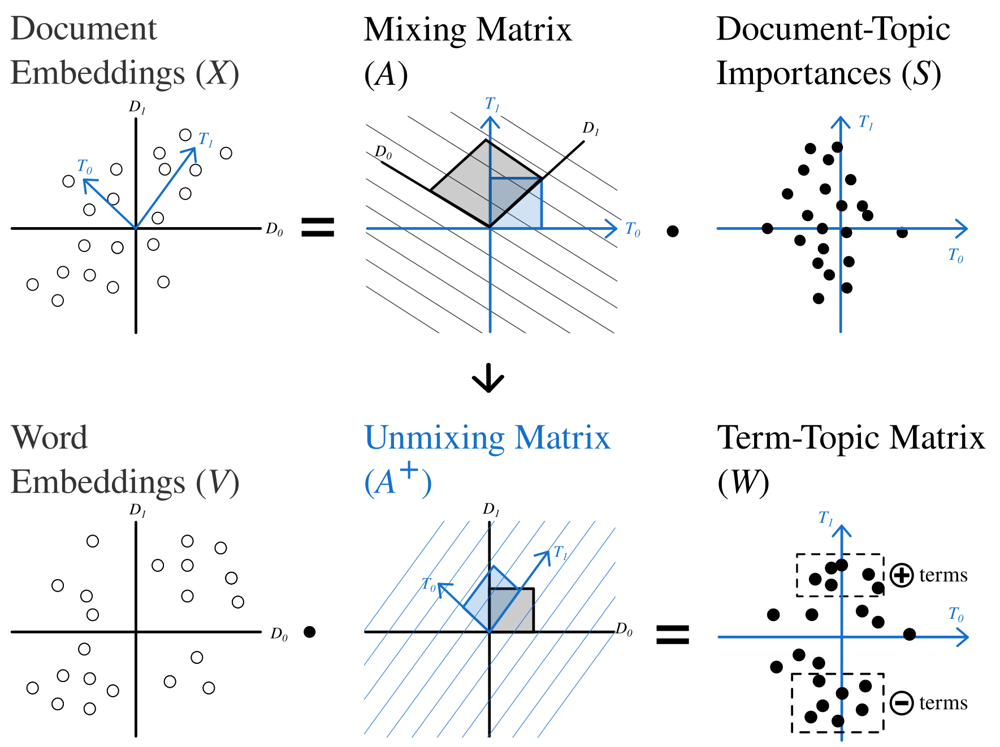
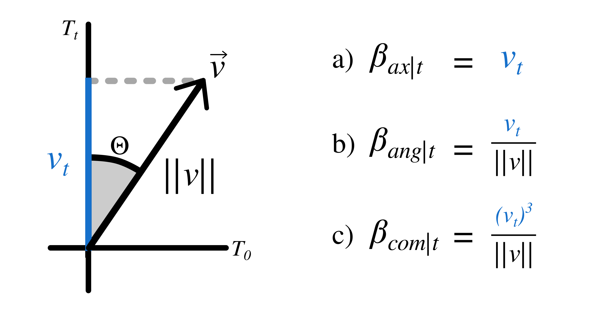
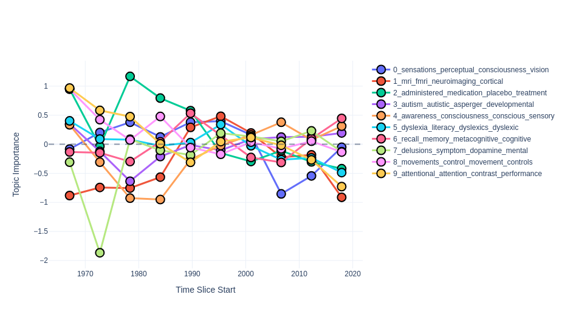
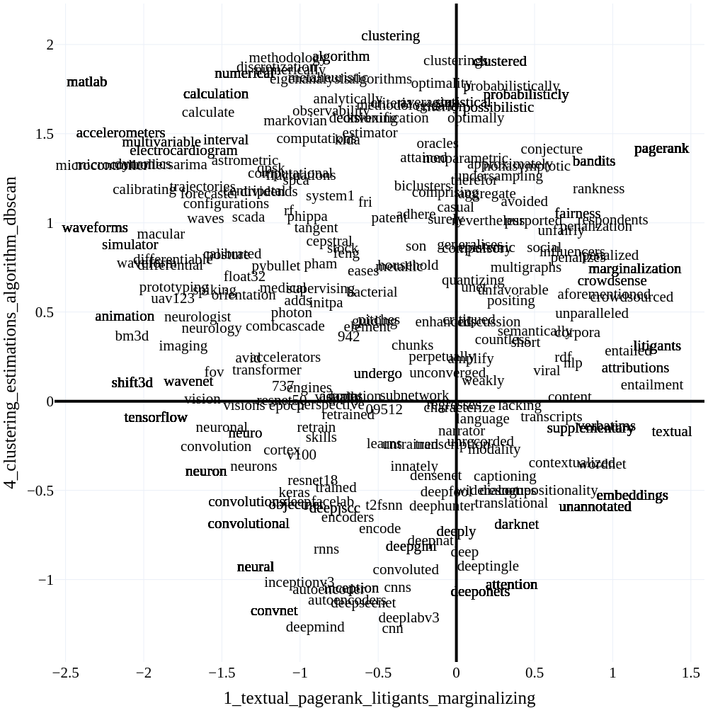

# Semantic Signal Separation ($S^3$)

Semantic Signal Separation tries to recover dimensions/axes along which most of the semantic variations can be explained.
A topic in $S^3$ is an axis of semantics in the corpus.
This makes the model able to recover more nuanced topical content in documents, but is not optimal when you expect topics to be groupings of documents.

$S^3$ is one of the fastest topic models out there, even rivalling vanilla NMF, when not accounting for embedding time.
It also typically produces very high quality topics, and our evaluations indicate that it performs significantly better when no preprocessing is applied to texts.


<figure>
  
  <figcaption> Schematic overview of S³  </figcaption>
</figure>

## How does $S^3$ work?

### Encoding

Documents in $S^3$ get first encoded using an [encoder model](encoders.md).

- Let the encodings of documents in the corpus be $X$.

### Decomposition

The next step is to decompose the embedding matrix using ICA, this step discovers the underlying semantics axes as latent independent components in the embeddings.

- Decompose $X$ using FastICA: $X = AS$, where $A$ is the mixing matrix and $S$ is the document-topic-matrix.

### Term Importance Estimation


Term importances for each topic are calculated by encoding the entire vocabulary of the corpus using the same embedding model,
then recovering the strength of each latent component in the word embedding matrix.
The strength of the components in the words will be interpreted as the words' importance in a given topic.

- Let the matrix of word encodings be $V$.
- Calculate the pseudo-inverse of the mixing matrix $C = A^{+}$, where $C$ is the _unmixing matrix_.
- Project word embeddings onto the semantic axes by multiplying them with unmixing matrix: $W = VC^T$. $W^T$ is then the topic-term matrix (`model.components_`).

<figure>
  
  <figcaption> Visual representation of term importance approaches in S³  </figcaption>
</figure>

There are three distinct methods to calculate term importances from word projections:

1. *Axial* word importances (`feature_importance="axial"`) are defined as the words' positions on the semantic axes. The importance of word $j$ for topic $t$ is: $\beta_{tj} = W_{jt}$.
2. *Angular* topics (`feature_importance="angular"`) can be calculated by taking the cosine of the angle between projected word vectors and semantic axes:
$\beta_{tj} = cos(\Theta) = \frac{W_{jt}}{||W_j||}$
3. *Combined* (`feature_importance="combined"`, this is the default) word importance is a combination of the two approaches
$\beta_{tj} = \frac{(W_{jt})^3}{||W_j||}$

Typically, the difference between these is relatively minuscule in terms of performance.
Based on our evaluations, however, we recommend that you use axial or combined topics.
Axial topics tend to result in the most coherent topics, while angular topics result in the most distinct ones.
The combined approach is a reasonable compromise between the two methods, and is thus the default.

### Dynamic Topic Modeling *(Optional)*

$S^3$ can also be used as a dynamic topic model.
Temporally changing components are found using the following steps:

1. Fit a global $S^3$ model over the whole corpus.
2. Estimate unmixing matrix for each time-slice by fitting a linear regression from the embeddings in the time slice to the document-topic-matrix for the time slice estimated by the global model.
3. Estimate term importances for each time slice the same way as the global model.

```python
from turftopic import SemanticSignalSeparation

model = SemanticSignalSeparation(10).fit_dynamic(corpus, timestamps=ts, bins=10)
model.plot_topics_over_time()
```

!!! info
    Topics over time in $S^3$ are treated slightly differently to most other models.
    This is because topics are not proportional in $S^3$, and can tip below zero.
    In the timeslices where a topic is below zero, its **negative definition** is displayed.

<figure>
  
  <figcaption> Topics over time in a dynamic Semantic Signal Separation model. </figcaption>
</figure>


## Model Refitting

Unlike most other models in Turftopic, $S^3$ can be refit using different parameters and random seeds without needing to initialize the model from scratch.
This makes $S^3$ incredibly convenient for exploring different numbers of topics, or adjusting the number of iterations.

Refitting the model takes a fraction of the time of initializing a new one and fitting it, as the vocabulary doesn't have to be learned or encoded by the model again.

```python
from turftopic import SemanticSignalSeparation

model = SemanticSignalSeparation(5, random_state=42)
model.fit(corpus)

print(len(model.topic_names))
# 5

model.refit(n_components=10, random_state=30)
print(len(model.topic_names))
# 10
```

## Interpretation

### Negative terms

Terms, which rank lowest on a topic have meaning in $S^3$.
Whenever interpreting semantic axes, you should probably consider both ends of the axis.
As such, when you print or export topics from $S^3$, the lowest ranking terms will also be shown along with the highest ranking ones.

Here's an example on ArXiv ML papers:

```python
from turftopic import SemanticSignalSeparation
from sklearn.feature_extraction.text import CountVectorizer

model = SemanticSignalSeparation(5, vectorizer=CountVectorizer(), random_state=42)
model.fit(corpus)

model.print_topics(top_k=5)
```

|   | **Positive**                                                     | **Negative**                                              |
|---|------------------------------------------------------------------|-----------------------------------------------------------|
| 0 | clustering, histograms, clusterings, histogram, classifying      | reinforcement, exploration, planning, tactics, reinforce  |
| 1 | textual, pagerank, litigants, marginalizing, entailment          | matlab, waveforms, microcontroller, accelerometers, microcontrollers |
| 2 | sparsestmax, denoiseing, denoising, minimizers, minimizes        | automation, affective, chatbots, questionnaire, attitudes  |
| 3 | rebmigraph, subgraph, subgraphs, graphsage, graph                | adversarial, adversarially, adversarialization, adversary, security |
| 4 | clustering, estimations, algorithm, dbscan, estimation           | cnn, deepmind, deeplabv3, convnet, deepseenet              |


### Concept Compass

If you want to gain a deeper understanding of terms' relation to axes, you can produce a *concept compass*.
This involves plotting terms in a corpus along two semantic axes.

In order to use the compass in Turftopic you will need to have `plotly` installed:

```bash
pip install plotly
```

You can display a compass based on a fitted model like so:

```python
fig = model.concept_compass(topic_x=1, topic_y=4)
fig.show()
```

<figure>
  
  <figcaption> Concept Compass of ArXiv ML Papers along two semantic axes. </figcaption>
</figure>


## API Reference

::: turftopic.models.decomp.SemanticSignalSeparation
