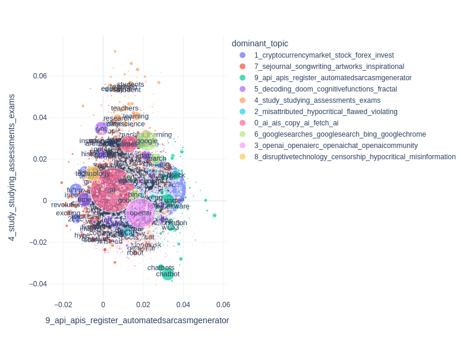

# Semantic Signal Separation (S³)

Semantic Signal Separation tries to recover dimensions/axes along which most of the semantic variations can be explained.
A topic in S³ is a dimension of semantics, or a "semantic signal". 
This makes the model able to recover more nuanced topical content in documents, but is not optimal when you expect topics to be groupings of documents.

<figure>
  
  <figcaption>PCA and ICA Recovering Underlying Signals <br> (figure from scikit-learn's documentation) </figcaption>
</figure>

## The Model

### 1. Semantic Signal Decomposition

S³ finds semantic signals in the embedding matrix by decomposing it either with Independent Component Analysis(default) or with Principal Component Analysis.
The difference between these two is that PCA finds maximally uncorrelated(orthogonal) components, while ICA recovers maximally independent signals.

To use one or the other, set the `objective` parameter of the model:

```python
from turftopic import SemanticSignalSeparation

# Uses ICA
model = SemanticSignalSeparation(10, objective="independence")

# Uses PCA
model = SemanticSignalSeparation(10, objective="orthogonality")
```

My anecdotal experience indicates that ICA generally gives better results, but feel free to experiment with the two options.

Turftopic uses the FastICA and PCA implementations from scikit-learn in the background.

### 2. Term Importance Estimation: Recovering Signal Strength for the Vocabulary

To estimate the importance of terms for each component, S³ embeds all terms with the same encoder as the documents, and decomposes the vocabulary embeddings with the fitted components.
The decomposed signals' matrix is then transposed to get a topic-term matrix.

## Comparison to Classical Models

S³ is potentially the closest you can get with contextually sensitive models to classical matrix decomposition approaches, such as NMF or Latent Semantic Analysis.
The conceptualization is very similar these models, but instead of recovering factors of word use, S³ recovers dimensions in a continuous semantic space.

Most of the intuitions you have about LSA will also apply with S³, but it might give more surprising results, as embedding models can potentially learn different efficient representations of semantics from humans.

S³ is also way more robust to stop words, meaning that you won't have to do extensive preprocessing.

## Interpretation

S³ is one of the trickier models to interpret due to the way it conceptualizes topics.
Unlike many other models, the fact that a word ranks very low for a topic is also useful information for interpretation's sake.
In other words, both ends of term importance are important for S³, words that rank highest, and words that rank lowest.

To investigate these relations, we recommend that you use [Word Maps from topicwizard](https://x-tabdeveloping.github.io/topicwizard/figures.html#word-map).
Word maps allow you to display the distribution of all words in the vocabulary on two given topic axes.

```bash
pip install topic-wizard
```

```python
from turftopic import SemanticSignalSeparation
from topicwizard import figures

model = SemanticSignalSeparation(10)
topic_data = model.prepare_topic_data(chatgpt_tweets)

figures.word_map(
  topic_data,
  topic_axes=(
     "9_api_apis_register_automatedsarcasmgenerator",
     "4_study_studying_assessments_exams"
  )
)
```

<figure>
  
  <figcaption>Word Map with two Discovered Semantic Components as Axes</figcaption>
</figure>

## Considerations

### Strengths

 - Nuanced Content: Documents are assumed to contain multiple topics and the model can therefore work on corpora where texts are longer and might not group in semantic space based on topic.
 - Efficiency: FastICA is called fast for a reason. S³ is one of the most computationally efficient models in Turftopic.
 - Novel Descriptions: S³ tends to discover topics that no other models do. This is due to its interpretation of what a topic is.
 - High Quality: Topic descriptions tend to be high quality and easily interpretable.

### Weaknesses

 - Noise Components: The model tends to find components in corpora that only contain noise. This is typical in other applications of ICA as well, and it is frequently used for noise removal in other disciplines. We are working on automated solutions to detect and flag these components.
 - Sometimes Unintuitive: Neural embedding models might have a different mapping of the semantic space than humans. Sometimes S³ uncovers unintuitive dimensions of meaning as a result of this.
 - Moderate Scalability: The model cannot be fitted in an online fashion. It is reasonably scalable, but for very large corpora you might want to consider using a different model.

## API Reference

::: turftopic.models.decomp.SemanticSignalSeparation
