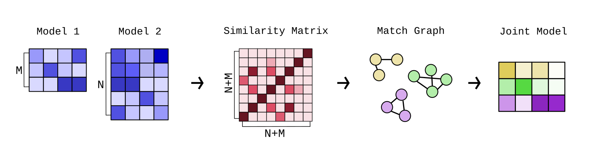
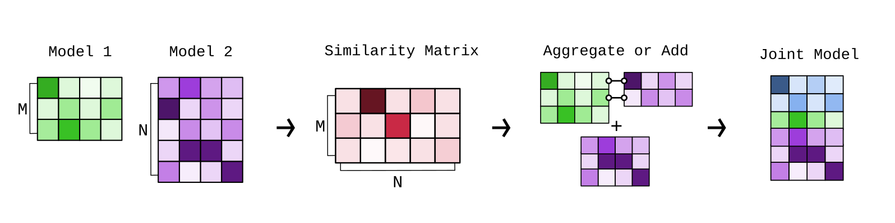

# Model/Topic Merging

In Turftopic, some models allow you to merge information from multiple topic models into one.
Currently, this can be done with SensTopic's `partial_fit` method, which updates a topic model by merging it with an identically initialized model
on a new batch of data.
More models will be implemented in the future.
This guide teaches you about the different methods for merging topics and explanations on why they are useful, and how you should use them.

Topic merging consists of the following steps:

1. Determine topic matches based on some **topic representations** (typically a model's `components_` attribute) and a **similarity threshold**
2. Aggregating the topic representations based on some **aggregation regime**

See the default named options from Turftopic in the table bellow.
We deem these to be reasonable defaults that cover most of the functionality, users might be interested in.

| Merge method | Match type | Aggregation | Recommended Use Cases |
| ------------ | ---------- | ----------- | --------------------- |
| `symmetric_mean` | Symmetric | `np.average` | Online model fitting on static datasets. |
| `asymmetric_mean` | Asymmetric | `np.average` | Dynamic modelling, static analyses, where intermediate states are used for analysis. |
| `keep_first` | Asymmetric | `keep_first` | Dynamic modelling, where intermediate states should be immutable. |

## Determining matches

When merging topic models, it's important to know the difference between symmetric and asymmetric merges.

### Symmetric merge

A symmetric merge treats both models as equal, and finds matching topics in all models at the same time to then merge them into a single topic in the new model.

<figure>
  
</figure>

This is done in the following steps:

 1. We calculate a **topic similarity matrix** between topics from all models. By default this is based on topic representations' cosine similarity.
 2. We compute a **match matrix** based on the similarity matrix and a **similarity threshold**. The default value is `0.7`.
 3. The match matrix is used as a **match graph** between all topics in the models.
 4. To find, which topics should be aggregated to derive the new topics, we find graph components in the match graph.
   Each component of the match graph is then assumed to be the same topic, and each component will be aggregated into a new topic.

!!! note
    When using symmetric merge, the number of topics from one step to another could go **down** not just up.
    This is because sometimes the new model introduces bridges in the match graph between old topics, that then get merged into one larger topic.
    This is important to take into account when you make assumptions about the way your topics behave.

A symmetric merge is a good fit, if you wish to find all topics in a corpus, and you do not base any of your analyses on intermediate states of the model.
Using symmetric merges on a static dataset is a good idea, using it on temporal data (dynamic modelling) is a bad idea.

### Asymmetric merge

During an asymmetric merge, earlier models take precedence over new ones.
What this means is that newer models' content get merged into older models, while the older models' structure is left unscathed.

<figure>
  
</figure>

The old model's topics might get updated based on the new model, but they will not be removed or merged into other topics.
This also means that the number of topics never decreases, only increases over time.

1. For each pair of old and new model:
    1. Calculate the similarity and match matrices *between* the old and new model.
    2. Aggregate the matches from the new model into the old models topics.

You should use an asymmetric merge either if you want to keep your analyses in-tact based on intermediate states,
or if you want to make the assumption that the number of topics is non-decreasing over time.
Asymmetric merges are perfect for instance for dynamic topic modelling.

## Aggregation Regimes

You can technically use any aggregation method to aggregate topics between matches, but there are two defaults used in Turftopic,
that probably cover most use cases.

### `np.average`

`np.average` takes the weighted arithmetic mean of topic representations.
By default, no weights are provided, but most models, where there is a deliberate implementation included, averages are weighted by the number of documents the models have seen.

This aggregation method is very useful when you want all of your data to influence your topics,
and you don't care whether the keywords throughout your analysis change for the topics.

### `keep_first`

`keep_first` aggregation ignores all topics except the first one in a match.
This means that topics that are already in the model will be immutable.
New topics will be added, but the ones in the model will not change.

This is great when you need to make the assumption that old topics never change.
For instance, when you have already based some of your analyses on old topics in your model, new information should not change those analyses.

## API Reference

::: turftopic.merging.symmetric_merge

::: turftopic.merging.asymmetric_merge

::: turftopic.merging.keep_first
