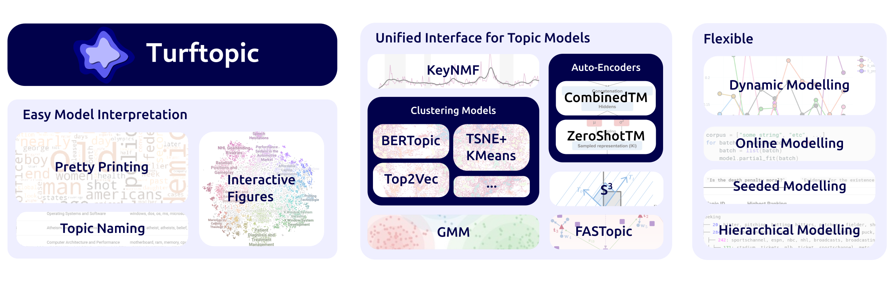

# Summary

Topic models are machine learning techniques that are able to discover themes in a set of documents.
Turftopic is a topic modelling library including a number of recent developments in topic modelling that go beyond bag-of-words models and can understand text in context, utilizing representations from transformers.
Turftopic focuses on ease of use, providing a unified interface for a number of different modern topic models, and boasting both model-specific and model-agnostic interpretation and visualization utilities.
While the user is afforded great flexibility in model choice and customization, the library comes with reasonable defaults, so as not to needlessly overwhelm first-time users.
In addition, Turftopic allows the user to: a) model topics as they change over time, b) learn topics on-line from a stream of texts, c) find hierarchical structure in topics, d) learning topics in multilingual texts and corpora.
Users can utilize the power of large language models (LLMs) to give human-readable names to topics.
Turftopic also comes with built-in utilities for generating topic descriptions based on key-phrases or lemmas rather than individual words.

# Statement of Need

While a number of software packages have been developed for contextual topic modelling in recent years, including BERTopic [@bertopic_paper], Top2Vec [@top2vec], CTM [@ctm], these packages include implementations of one or two topic models, and most of the utilities they provide are model-specific. This has resulted in the unfortunate situation that practitioners need to switch between different libraries and adapt to their particularities in both interface and functionality.
Some attempts have been made at creating unified packages for modern topic models, including STREAM [@stream] and TopMost [@topmost].
These packages, however, have a focus on neural models and topic model evaluation, have abstract and highly specialized interfaces, and do not include some popular topic models.
Additionally, while model interpretation is fundamental aspect of topic modelling, the interpretation utilities provided in these libraries are fairly limited, especially in comparison with model-specific packages, like BERTopic.

Turftopic unifies state-of-the-art contextual topic models under a superset of the `scikit-learn` [@scikit-learn] API, which many users may be familiar with, and can be readily included in `scikit-learn` workflows and pipelines.
We focused on making Turftopic first and foremost an easy-to-use library that does not necessitate expert knowledge or excessive amounts of code to get started with, but gives great flexibility to power users.
Furthermore, we included an extensive suite of pretty-printing and model-specific visualization utilities that aid users in interpreting their results.
In addition, we provide native compatibility with `topicwizard` [@topicwizard], a model-agnostic topic model visualization library.
The library also includes three topic models that, to our knowledge, only have implementations in Turftopic: KeyNMF [@keynmf], Semantic Signal Separation (S^3^) [@s3], and GMM, a Gaussian Mixture model of document representations with a soft-c-tf-idf term weighting scheme.

# Functionality

Turftopic includes a wide array of contextual topic models from the literature, these include:
FASTopic [@fastopic], Clustering models, such as BERTopic [@bertopic_paper] and Top2Vec [@top2vec], auto-encoding topic models, like CombinedTM [@ctm] and ZeroShotTM [@zeroshot_tm], KeyNMF [@keynmf], S^3^ [@s3] and GMM.
At the time of writing, these models are representative of the state of the art in contextual topic modelling and intend to expand on them in the future.

{width="800px"}

Each model in Turftopic has an *encoder* component, which is used for producing continuous document-representations [@sentence_transformers], and a *vectorizer* component, which extracts term counts in each documents, thereby dictating which terms will be considered in topics.
The user has full control over what components should be used at different stages of the topic modelling process, thereby having fine-grained influence on the nature and quality of topics.

The library comes loaded with numerous utilities to help users interpret their results, including *pretty printing* utilities for exploring topics, *interactive visualizations* partially powered by the `topicwizard` [@topicwizard] Python package, and *automated topic naming* with LLMs.

To accommodate a variety of use cases, Turftopic can be used for *dynamic* topic modelling, where topics are expected to change over time.
Turftopic is also capable of extracting topics at multiple levels of granularity, thereby uncovering *hierarchical* topic structures.
Some models can also be fitted in an *online* fashion, where documents are accounted for as they come in batches.
Turftopic also includes *seeded* topic modelling, where a seed phrase can be used to retrieve topics relevant to the specific research question.

# Use cases

Topic models can be and have been utilized for numerous purposes in both academia and industry.
They are a key tool in digital/computational humanities, mainly as an instrument of quantitative text analysis or *distant reading*  [@quantitative_text_analysis],
as topic models can pick up on macro-patterns in corpora, at times missed by close readers [@macroanalysis],
and might be able to provide a more impartial account of a corpus's content.
Topic models can also aid discourse analysis by facilitating exploratory data analysis, and quantitative modelling of information dynamics [@discourse_analysis].
Industry analysts might make use of topic models for analyzing customer feedback [@hotel_sector] or social media data related to a company's products [@social_media_mining].

Since topic models learn topically informative representations of text, they can also be utilized for down-stream applications,
such as content filtering, recommendation [@content_recommendation],
unsupervised classification [@unsupervised_classification], information retrieval [@information_retrieval] and pre-training data curation [@data_mixers].

The Turftopic framework has already been utilized by @keynmf for analyzing information dynamics in Chinese diaspora media, and is currently being used in multiple ongoing research projects,
including one concerning the media coverage of the HPV vaccine in Denmark,
and another studying Danish golden-age literature.
We provide examples of correct usage and case studies as part of our documentation.

# Target Audience

Turftopic's utility has already been demonstrated for computational scholars in digital humanities, and political science,
and we expect that it will be of utility to a diverse audience of researchers in social sciences, medicine, linguistics and legal studies.
It can furthermore prove valuable to business analysts working with text-based data to generate qualitative insights.

As the focus on pre-training data mixing techniques is on the rise, we expect that Turftopic will help facilitate foundational language model research.
The library's design, wide array of models, and flexibility are also aimed at enabling usage in more extended production pipelines for retrieval, filtering or content recommendation, and we thus expect the package to be a most valuable tool for the industry NLP practitioner.

Turftopic is also an appropriate choice for educational purposes, providing instructors with a single, user-friendly framework for students to explore and compare alternative topic modelling approaches.

# References
